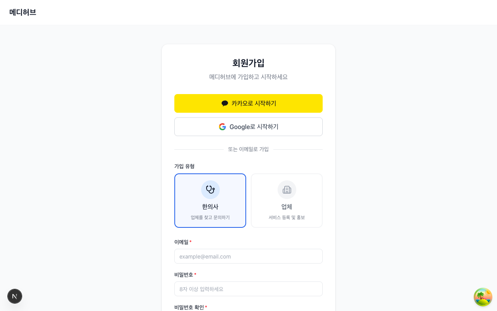
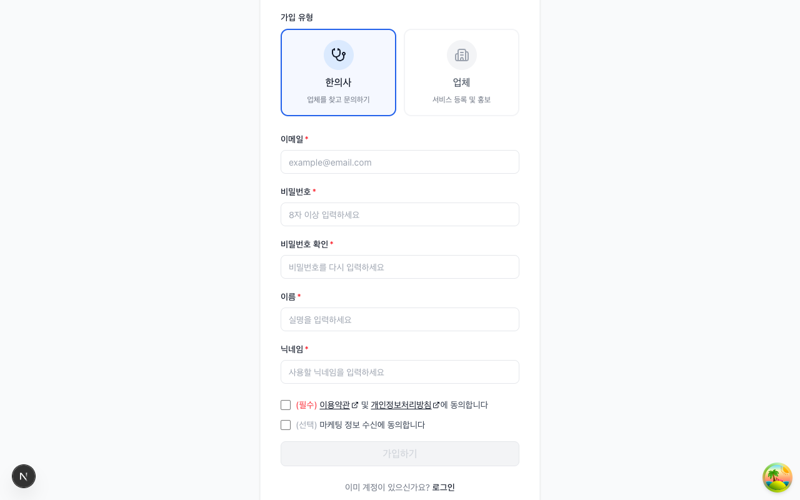
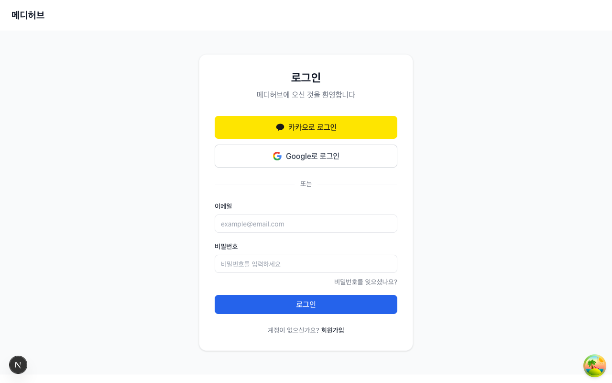
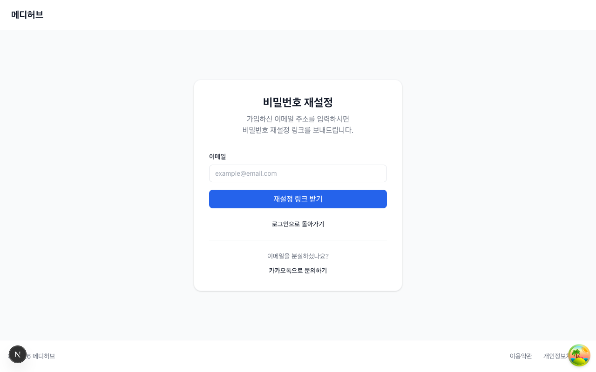
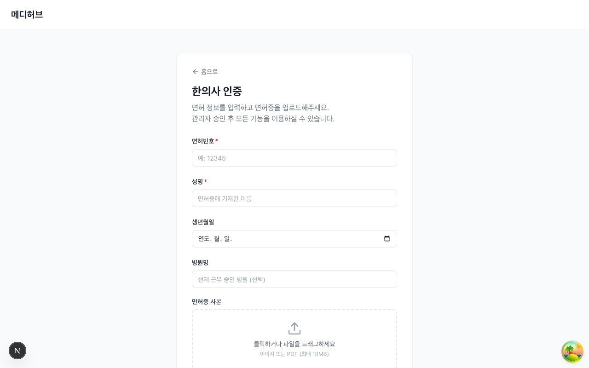
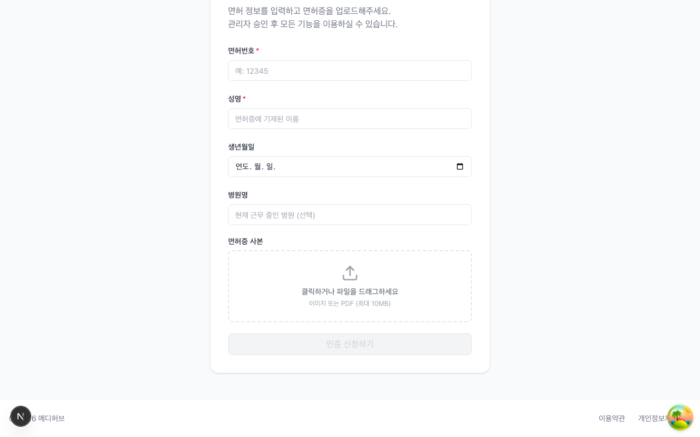
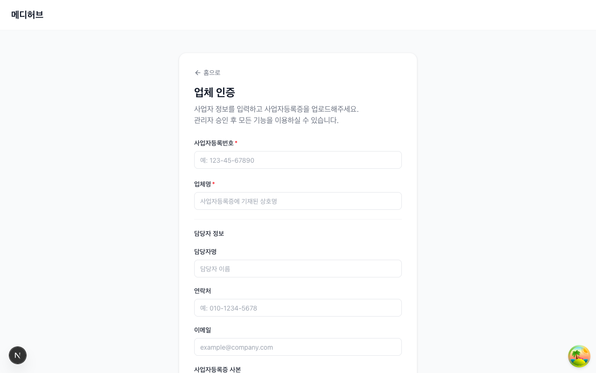
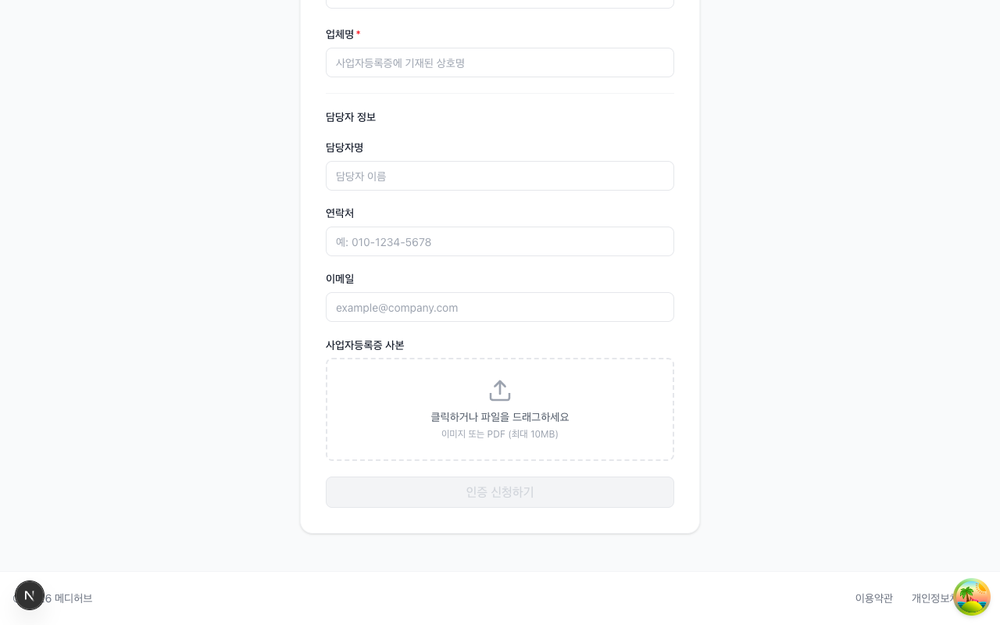

# 시작하기

> 메디허브(Medihub) 플랫폼의 가입, 로그인, 인증, 온보딩 과정을 안내합니다.

---

## 1. 플랫폼 소개

### 1-1. 메디허브란?

메디허브는 **의료인(한의사)과 의료산업 업체를 연결하는 B2B 마켓플레이스**입니다. 병의원 개원 및 운영에 필요한 업체(원외탕전, 의료기기, 인테리어, 마케팅, 세무 등)를 검색하고, 비교하고, 문의할 수 있습니다.

### 1-2. 사용자 역할

메디허브에는 3가지 역할이 있습니다:

| 역할 | 설명 | 주요 기능 |
|------|------|---------|
| **한의사 (Doctor)** | 업체를 검색하고 문의하는 의료인 | 업체 검색/비교, 문의(리드) 생성, 리뷰 작성, 찜 |
| **업체 (Vendor)** | 서비스를 등록하고 문의에 응답하는 파트너 | 상품 등록, 리드 응답, 크레딧/광고/구독 관리 |
| **관리자 (Admin)** | 플랫폼 전체를 운영하는 관리자 | 인증 승인, 사용자/업체 관리, 통계, 정산 |

---

## 2. 회원가입

### 2-1. 회원가입 페이지 접근

메인 페이지 우측 상단의 **회원가입** 버튼을 클릭합니다.



### 2-2. 가입 유형 선택

회원가입 페이지에서 **가입 유형**을 선택합니다:

- **한의사**: 업체를 찾고 문의하기 위한 의료인 계정
- **업체**: 서비스 등록 및 홍보를 위한 파트너 계정

> 소셜 로그인(카카오/구글)으로도 가입이 가능합니다. 소셜 로그인 시에도 역할 선택 및 추가 정보 입력이 필요합니다.

### 2-3. 필수 입력 정보



**공통 필수 입력:**
- **이메일**: 로그인 ID로 사용됩니다
- **비밀번호**: 8자 이상
- **비밀번호 확인**: 비밀번호 재입력
- **이름**: 실명 입력
- **닉네임**: 플랫폼에서 표시될 닉네임

**약관 동의:**
- **(필수)** 이용약관 및 개인정보처리방침 동의
- **(선택)** 마케팅 정보 수신 동의

### 2-4. 소셜 로그인 (카카오/구글)

회원가입 또는 로그인 페이지에서 소셜 로그인 버튼을 클릭하면:

1. 해당 소셜 서비스의 인증 페이지로 이동
2. 인증 완료 후 메디허브로 복귀
3. **최초 로그인 시** 역할 선택(한의사/업체) + 추가 정보 입력(온보딩)
4. 프로필 생성 완료 후 메인 페이지로 이동

> 기존 이메일 계정과 동일한 이메일로 소셜 로그인 시, 계정 충돌이 발생할 수 있습니다. 이 경우 기존 계정으로 로그인한 후 **계정 설정 > 소셜 계정 연결**에서 연결하세요.

---

## 3. 로그인/로그아웃

### 3-1. 로그인



1. 메인 페이지 우측 상단의 **로그인** 버튼 클릭
2. **이메일**과 **비밀번호** 입력
3. **로그인** 버튼 클릭
4. 로그인 성공 시 메인 페이지로 이동

**소셜 로그인:**
- **카카오로 로그인**: 노란색 카카오 버튼 클릭
- **Google로 로그인**: Google 버튼 클릭

### 3-2. 로그아웃

우측 상단의 **사용자 이름/프로필** 영역을 클릭하면 드롭다운 메뉴가 나타납니다. **로그아웃**을 선택하면 세션이 종료됩니다.

---

## 4. 비밀번호 재설정



1. 로그인 페이지에서 **비밀번호를 잊으셨나요?** 링크 클릭
2. 가입 시 사용한 **이메일 주소** 입력
3. **재설정 링크 받기** 버튼 클릭
4. 이메일로 발송된 링크를 클릭하여 새 비밀번호 설정

> 이메일을 분실한 경우, 하단의 **카카오톡으로 문의하기** 링크를 통해 고객지원에 문의하세요.

---

## 5. 온보딩 플로우

### 5-1. 최초 로그인 시 약관 동의

가입 후 첫 로그인 또는 약관 버전이 변경된 경우, **약관 동의 모달**이 표시됩니다.

- **(필수)** 이용약관 및 개인정보처리방침에 동의해야 서비스 이용이 가능합니다
- 동의하지 않으면 **로그아웃** 처리됩니다

### 5-2. 역할별 온보딩

**한의사 온보딩:**

회원가입 완료 후, 한의사 인증 페이지로 이동하여 면허 정보를 제출합니다.



1. 가입 완료 → 한의사 인증 페이지(`/verification/doctor`)로 이동
2. **면허번호** (필수), **성명** (필수), **생년월일**, **병원명** 입력
3. **면허증 사본** 업로드 (이미지 또는 PDF, 최대 10MB)
4. **제출** 버튼 클릭 → 관리자 승인 대기
5. 승인 완료 후 → 업체 탐색/찜/문의 가능



**업체 온보딩:**

회원가입 완료 후, 업체 인증 페이지로 이동하여 사업자 정보를 제출합니다.



1. 가입 완료 → 업체 인증 페이지(`/verification/vendor`)로 이동
2. **사업자등록번호** (필수), **업체명** (필수) 입력
3. **담당자 정보**: 담당자명, 연락처, 이메일 입력
4. **사업자등록증 사본** 업로드 (이미지 또는 PDF, 최대 10MB)
5. **제출** 버튼 클릭 → 관리자 승인 대기
6. 승인 완료 후 → 프로필 완성/포트폴리오 등록/리드 수신 가능



---

## 6. 인증 상태

회원가입 후 역할에 맞는 인증 절차를 거쳐야 합니다. 인증 상태는 `/verification` 페이지에서 확인할 수 있습니다.

### 6-1. 한의사 인증


**인증 제출 정보:**
- **면허번호** (필수): 한의사 면허 번호 (예: 12345)
- **성명** (필수): 면허증에 기재된 이름
- **생년월일**: 연도.월.일 선택
- **병원명**: 현재 근무 중인 병원 (선택)
- **면허증 사본**: 이미지 또는 PDF 업로드 (최대 10MB)

### 6-2. 업체 인증


**인증 제출 정보:**
- **사업자등록번호** (필수): 사업자등록증의 등록번호 (예: 123-45-67890)
- **업체명** (필수): 사업자등록증에 기재된 상호명
- **담당자명**: 담당자 이름
- **연락처**: 담당자 전화번호 (예: 010-1234-5678)
- **이메일**: 담당자 이메일
- **사업자등록증 사본**: 이미지 또는 PDF 업로드 (최대 10MB)

### 6-3. 인증 상태 흐름

```
대기중(pending) → 승인(approved)
                → 반려(rejected) → 수정 후 재제출
```

| 상태 | 설명 |
|------|------|
| **대기중 (Pending)** | 인증 서류가 제출되었고, 관리자 검토를 기다리는 상태 |
| **승인 (Approved)** | 관리자가 인증을 승인한 상태. 모든 기능 이용 가능 |
| **반려 (Rejected)** | 인증이 반려된 상태. 반려 사유 확인 후 수정하여 재제출 가능 |

> 인증 결과(승인/반려)는 이메일로 알림이 발송됩니다. 알림 설정에서 이메일 알림을 켜두세요.

---

## 7. 약관/동의

### 7-1. 이용약관

메디허브 서비스 이용에 관한 약관입니다. 가입 시 필수 동의가 필요하며, 하단 푸터의 **이용약관** 링크에서 언제든 확인할 수 있습니다.

### 7-2. 개인정보처리방침

개인정보의 수집, 이용, 보관에 관한 정책입니다. 가입 시 필수 동의가 필요합니다.

### 7-3. 마케팅 수신 동의

마케팅 정보 수신은 **선택** 항목입니다. 가입 시 또는 **마이페이지 > 알림 설정**에서 언제든 동의/철회할 수 있습니다.

> 약관은 버전 관리됩니다. 약관이 개정되면 로그인 시 재동의 모달이 표시됩니다.
