# 메인화면 / 검색 / 카테고리 / 업체 상세

> 메디허브의 메인 페이지, 카테고리 탐색, 업체 검색, 업체 상세 페이지, 문의하기 기능을 안내합니다.

---

## 1. 메인 페이지

### 1-1. 메인 페이지 접근

로그인 후 또는 비로그인 상태에서 메디허브에 접속하면 메인 페이지가 표시됩니다.

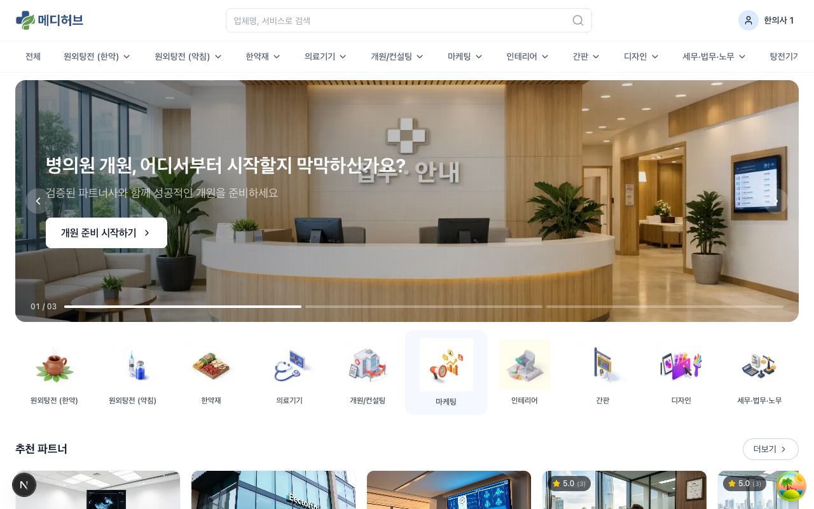

### 1-2. 메인 페이지 구성 요소

**상단 헤더:**
- **메디허브 로고**: 클릭 시 메인 페이지로 이동
- **검색창**: 업체명, 서비스로 검색 가능
- **로그인/회원가입** 버튼 (비로그인 시) 또는 **사용자 이름** (로그인 시)

**카테고리 내비게이션 바:**
- 전체 | 원외탕전(한약) | 원외탕전(약침) | 한약재 | 의료기기 | 개원/컨설팅 | 마케팅 | 인테리어 | 간판 | 디자인 | 세무/법무/노무 | 탕전기기 | 의류/침구류 | 병원관리 | 경영지원 | 교육/학술 | 라이프
- 클릭 시 해당 카테고리 페이지로 이동
- 하위 카테고리가 있는 경우 드롭다운으로 표시

**히어로 배너 슬라이더:**
- 3장의 배너가 자동 회전 (좌/우 화살표로 수동 전환 가능)
- 배너별 CTA 버튼 제공 (예: "개원 준비 시작하기", "의료기기 비교하기")
- 배너 하단에 현재 슬라이드 번호 표시 (예: 01 / 03)

> 배너는 **관리자 > 광고 관리 > 캠페인**에서 등록/관리합니다. 자세한 내용은 [04-관리자-가이드](04-관리자-가이드.md)를 참조하세요.

**카테고리 아이콘 그리드:**
- 주요 카테고리(원외탕전, 한약재, 의료기기, 개원/컨설팅, 마케팅, 인테리어, 간판, 디자인, 세무/법무/노무 등)가 아이콘과 함께 표시
- 클릭 시 해당 카테고리 페이지로 이동

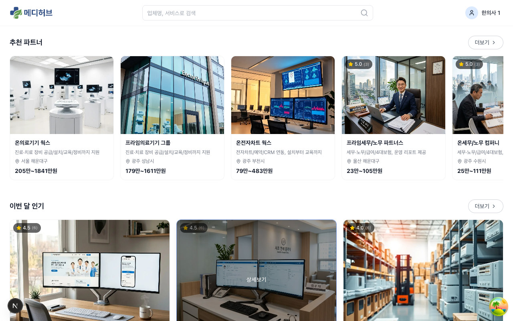

**추천 파트너 섹션:**
- 플랫폼에서 추천하는 업체들이 카드 형태로 표시
- 각 카드에는 **업체명**, **1줄 소개**, **지역**, **가격대**, **별점(리뷰수)** 표시
- **더보기** 버튼 클릭 시 전체 업체 리스트로 이동

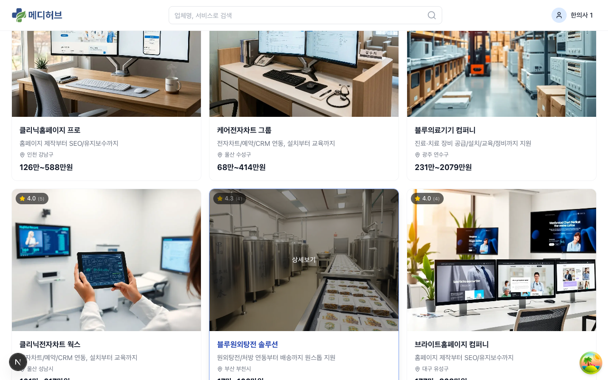

**이번 달 인기 섹션:**
- 인기 업체 목록 (리뷰/평점/조회 기반)
- 추천 파트너와 동일한 카드 형태

**하단 푸터:**
- 이용약관 / 개인정보처리방침 링크
- 저작권 표시

---

## 2. 카테고리 탐색

### 2-1. 전체 카테고리 목록

상단 카테고리 바에서 **전체**를 클릭하거나 `/categories` 경로로 접근합니다.

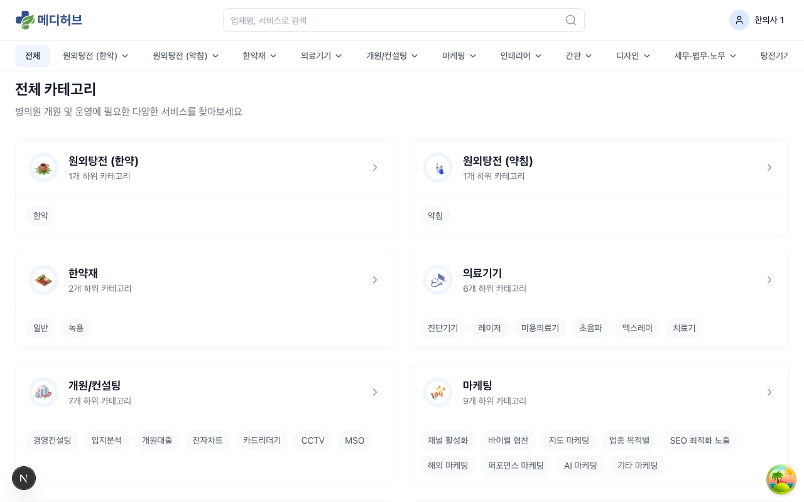

- 대카테고리별로 그룹화되어 표시
- 각 카테고리 옆에 **등록 업체 수** 표시
- 클릭 시 해당 카테고리의 업체 리스트 페이지로 이동

### 2-2. 카테고리 상세 페이지

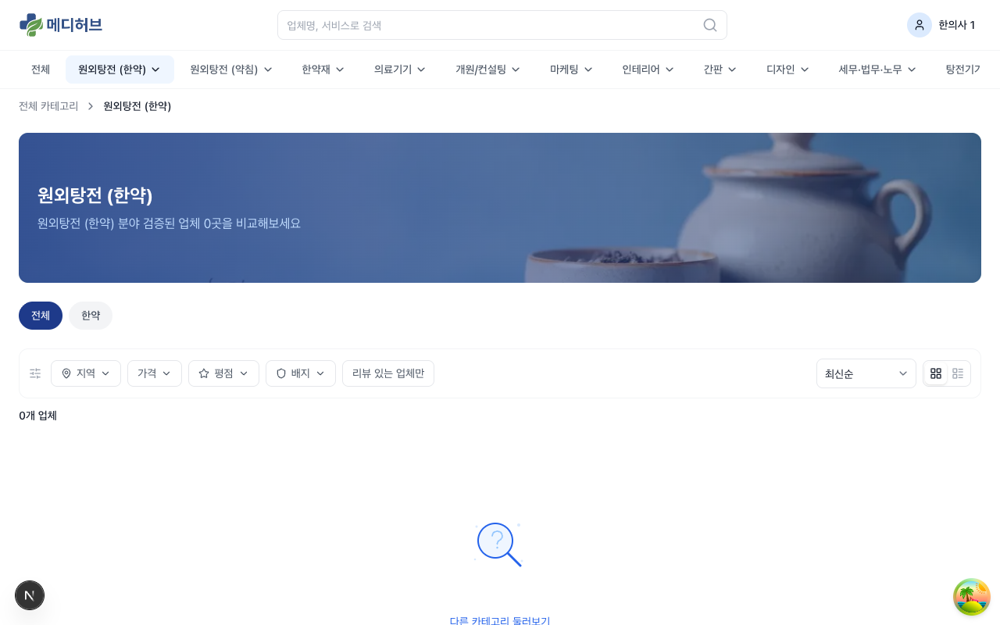

카테고리를 클릭하면 해당 카테고리의 업체 리스트 페이지가 표시됩니다.

**페이지 구성:**
- **카테고리 헤더**: 카테고리명, 설명, 배경 이미지
- **브레드크럼**: 전체 > 대카테고리 > 현재 카테고리
- **하위 카테고리 탭**: 소카테고리 전환 가능
- **필터/정렬 바**: 업체 필터링 및 정렬 옵션
- **업체 리스트**: 카드 형태로 업체 표시

### 2-3. 필터/정렬 옵션

**필터:**
- **지역**: 시/도 → 시/군/구 2단계 선택
- **평점**: 4.0 이상 / 4.5 이상
- **리뷰**: 리뷰 있는 업체만
- **응답률/응답시간**: 빠른 응답 업체
- **배지**: 메디허브 인증 / 프리미엄 파트너 등

**정렬:**
- 추천순 (기본)
- 최신순
- 평점 높은순
- 리뷰 많은순
- 응답 빠른순

> 카테고리 페이지 상단에는 **우선순위 광고 영역**이 있을 수 있습니다. 광고 업체는 등급별(프리미엄/플러스업/플러스/루키) 배경색 또는 배지로 구분됩니다.

---

## 3. 키워드 검색

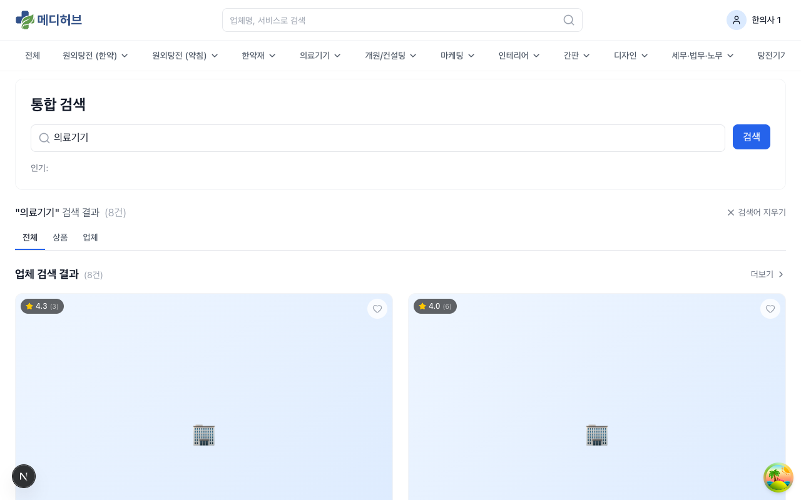

### 3-1. 검색 방법

1. 상단 헤더의 **검색창**에 키워드 입력 (예: "의료기기", "탕전", "인테리어")
2. **Enter** 또는 돋보기 아이콘 클릭
3. 통합 검색 결과 페이지로 이동

### 3-2. 검색 결과

- **업체 검색 결과**: 업체명, 서비스 소개, 태그에서 키워드 매칭
- 검색 결과에서도 **필터/정렬** 적용 가능

---

## 4. 업체 카드

업체 리스트에서 각 업체는 **카드 형태**로 표시됩니다.

**카드 구성 요소:**
- **썸네일 이미지**: 업체 대표 이미지 (AI 생성 기본 이미지 또는 업체 등록 이미지)
- **별점 배지**: 좌측 상단에 평점 + 리뷰 수 표시 (예: 5.0 (3))
- **업체명**: 클릭 시 업체 상세 페이지로 이동
- **1줄 소개**: 업체의 간략한 서비스 설명
- **지역**: 서비스 제공 지역
- **가격대**: 최소~최대 가격 범위 (예: 205만~1841만원)
- **배지**: 메디허브 인증, 빠른 응답, Top N%, 프리미엄 파트너, 신규 입점 등

---

## 5. 업체 상세 페이지

### 5-1. 업체 상세 접근

업체 카드를 클릭하면 업체 상세 페이지로 이동합니다.

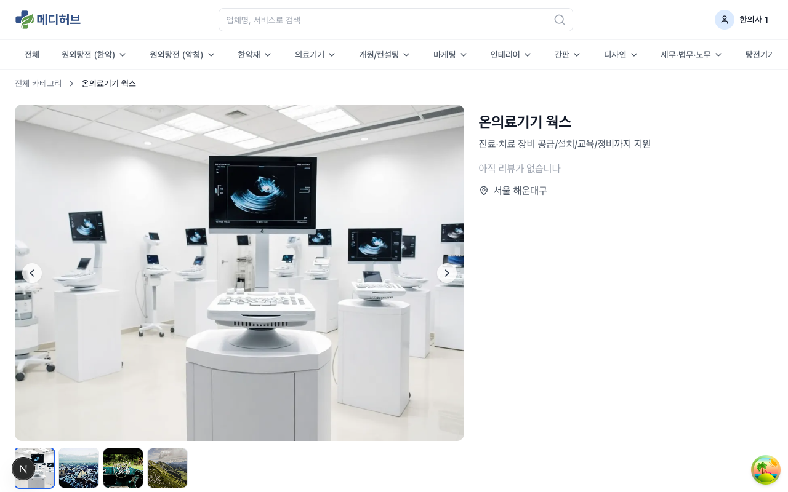

### 5-2. 상세 페이지 구성

**상단 영역:**
- **대표 이미지**: 업체의 메인 이미지
- **업체명**: 상호명
- **1줄 소개**: 간략한 서비스 설명
- **배지 목록**: 인증/빠른응답 등 업체 배지
- **평점 및 리뷰 수**: 별점 + 총 리뷰 개수
- **찜하기 버튼**: 하트 아이콘 (클릭 시 찜 목록에 추가)
- **문의하기 버튼**: 클릭 시 문의 양식 페이지로 이동

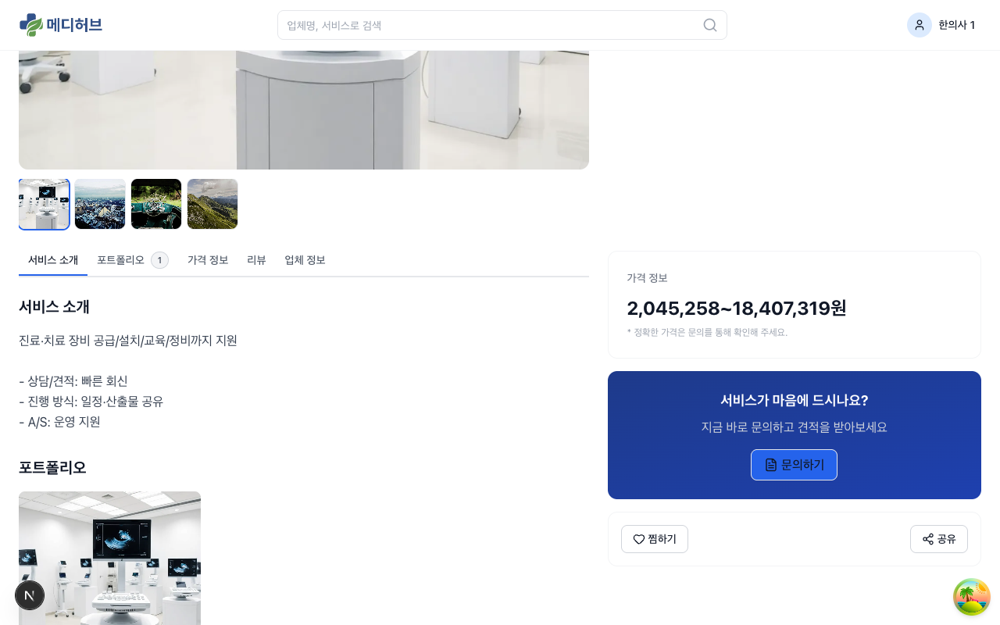

**탭 영역:**

- **서비스 소개**: 업체가 제공하는 서비스에 대한 상세 설명 (리치텍스트/마크다운 지원)
- **가격 정보**: 서비스별 가격표 (카테고리별 단가)
- **포트폴리오**: 업체의 시공/작업 사례 이미지 갤러리
- **리뷰**: 이용자들이 남긴 리뷰 (정렬, 세부 평점, 업체 답변 포함)
- **FAQ**: 자주 묻는 질문

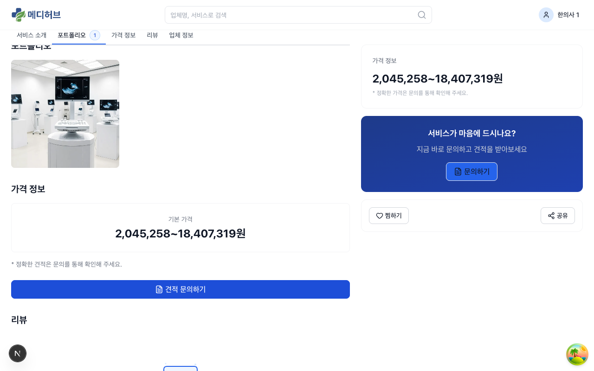

### 5-3. 리뷰 탭 상세

**리뷰 표시 정보:**
- 전체 평균 평점
- 세부 항목별 평점: 품질, 소통, 속도
- 개별 리뷰: 작성자, 작성일, 별점, 내용, 사진
- 업체 답변: 업체가 남긴 답글

**리뷰 정렬:**
- 최신순 / 평점 높은순 / 평점 낮은순

**리뷰 신고:**
- 부적절한 리뷰는 **신고** 버튼으로 접수 가능
- 관리자 심사 후 블라인드 처리

### 5-4. 찜하기

업체 상세 페이지 또는 업체 카드의 **하트 아이콘**을 클릭하면 찜 목록에 추가/제거됩니다.
찜한 업체는 **마이페이지 > 찜 목록**에서 확인할 수 있습니다.

---

## 6. 문의하기 (리드 생성)

### 6-1. 문의 양식 접근

업체 상세 페이지에서 **문의하기** 버튼을 클릭합니다.

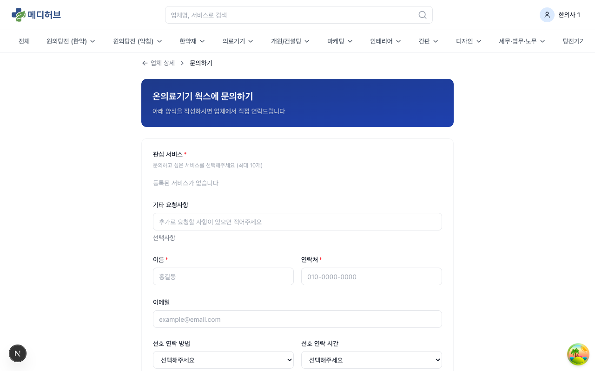

### 6-2. 문의 양식 입력

**필수 입력:**
- **관심 서비스**: 문의하고 싶은 서비스 선택 (최대 10개)
- **이름**: 문의자 이름
- **연락처**: 전화번호
- **문의 내용**: 상세 문의 내용

**선택 입력:**
- **기타 요청사항**: 추가 요청
- **이메일**: 이메일 주소
- **선호 연락 방법**: 전화 / 이메일 / 카카오톡 등
- **선호 연락 시간**: 오전 / 오후 / 저녁 등
- **소속**: 소속 병원/기관명
- **직책**: 직책
- **첨부 파일**: 관련 문서(사업자등록증, 도면 등) 업로드

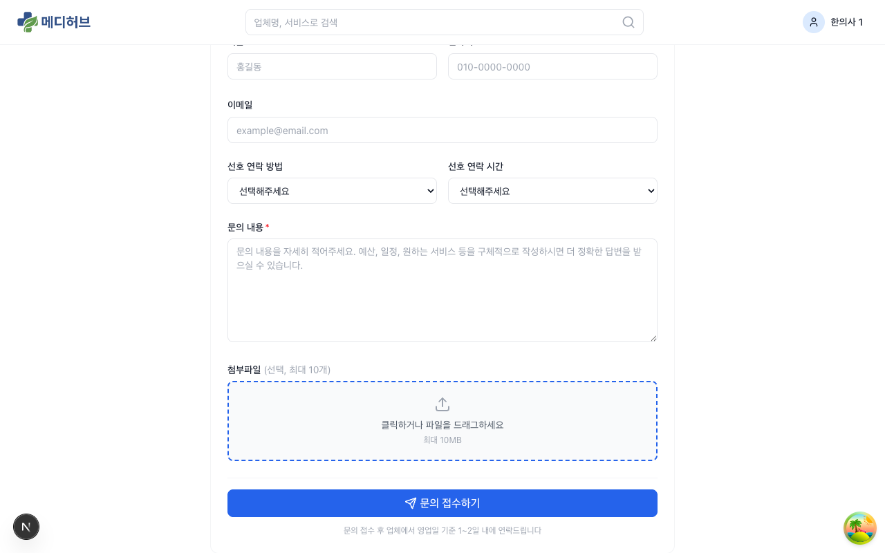

### 6-3. 문의 제출

1. 필수 항목을 모두 입력
2. **문의 제출** 버튼 클릭
3. 문의가 성공적으로 접수되면 확인 메시지 표시
4. 접수된 문의는 **마이페이지 > 내 문의함**에서 확인 가능

> 문의(리드)가 생성되면 해당 업체에게 알림이 발송됩니다. 업체의 크레딧에서 리드 비용이 자동 차감됩니다. (과금 상세는 [05-수익화-과금-가이드](05-수익화-과금-가이드.md) 참조)

---

## 7. 인테리어 비딩

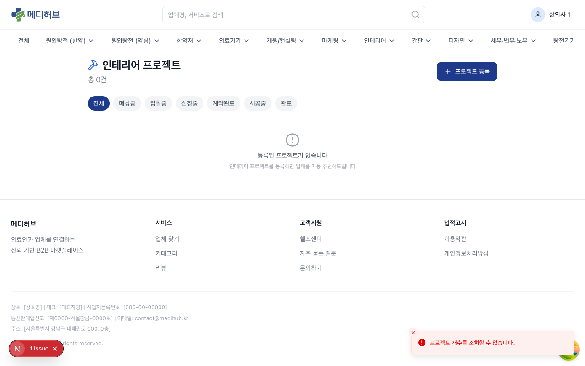

### 7-1. 인테리어 프로젝트

메인 카테고리 바에서 **인테리어**를 클릭하면 인테리어 전용 페이지로 이동합니다. 일반 카테고리와 달리 **비딩(입찰)** 방식으로 운영됩니다.

**비딩 프로세스:**
1. 한의사가 인테리어 프로젝트를 등록 (요구사항, 예산, 일정 등)
2. 시스템이 조건에 맞는 업체를 자동 매칭 (스코어링 기반: 지역 30%, 평점 25%, 응답률 20%, 포트폴리오 15%, 가격 10%)
3. 매칭된 업체(최대 3개)에게 입찰 요청 발송
4. 업체가 견적을 제출
5. 한의사가 견적을 비교하고 업체 선정
6. 계약 완료 시 수수료 3% 발생

---

## 8. 헬프센터

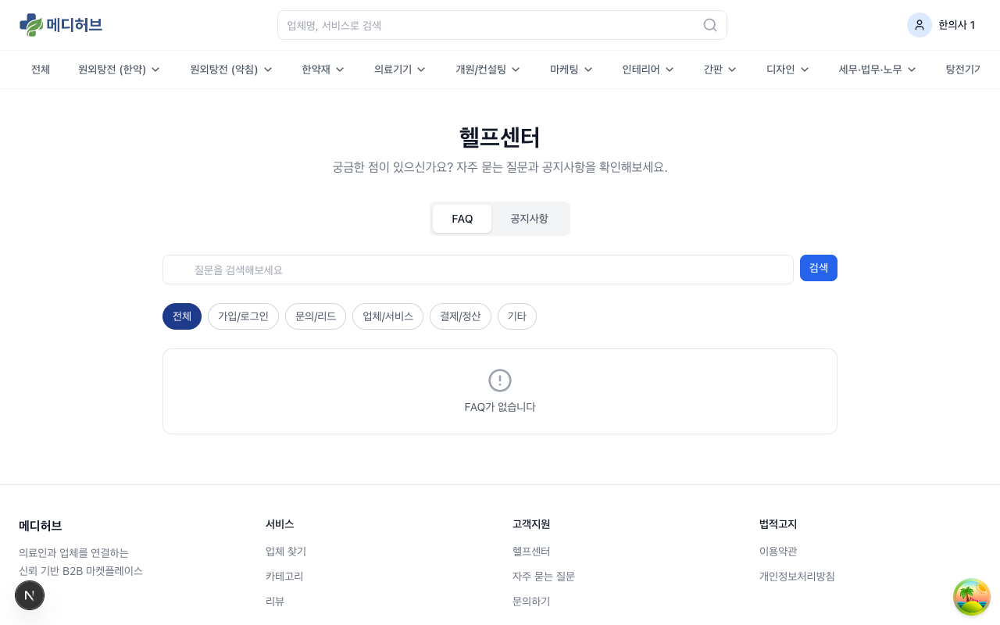

### 8-1. 헬프센터 접근

하단 푸터 또는 마이페이지의 **고객지원** 메뉴에서 접근할 수 있습니다.

### 8-2. 헬프센터 구성

- **FAQ**: 자주 묻는 질문과 답변
- **공지사항**: 플랫폼 공지 및 업데이트 소식

> FAQ 및 공지사항은 **관리자 > 헬프센터 관리**에서 등록/수정합니다.

---

## 9. 법적 문서

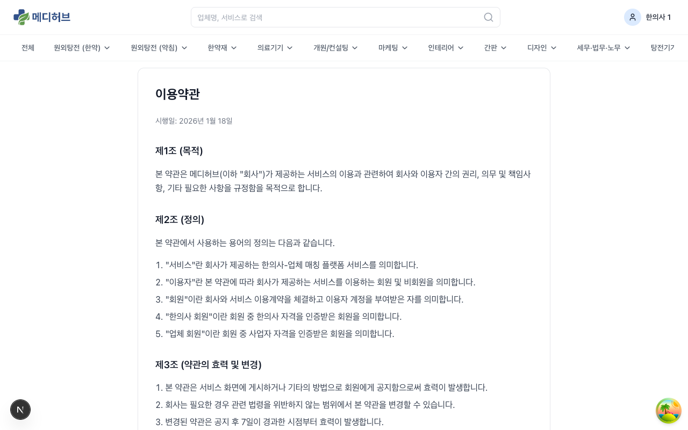

하단 푸터에서 접근할 수 있습니다:

- **이용약관** (`/legal/terms`): 서비스 이용 조건
- **개인정보처리방침** (`/legal/privacy`): 개인정보 처리 정책
- **리뷰 정책** (`/legal/review-policy`): 리뷰 작성 및 노출 기준
