# 한의사 가이드 (마이페이지)

> 한의사 역할의 마이페이지 기능을 안내합니다. 프로필 관리, 문의함, 찜, 리뷰, 고객지원, 알림/계정 설정 등을 포함합니다.

---

## 1. 마이페이지 개요

### 1-1. 마이페이지 접근

로그인 후 우측 상단의 **사용자 이름**을 클릭하면 마이페이지로 이동합니다.

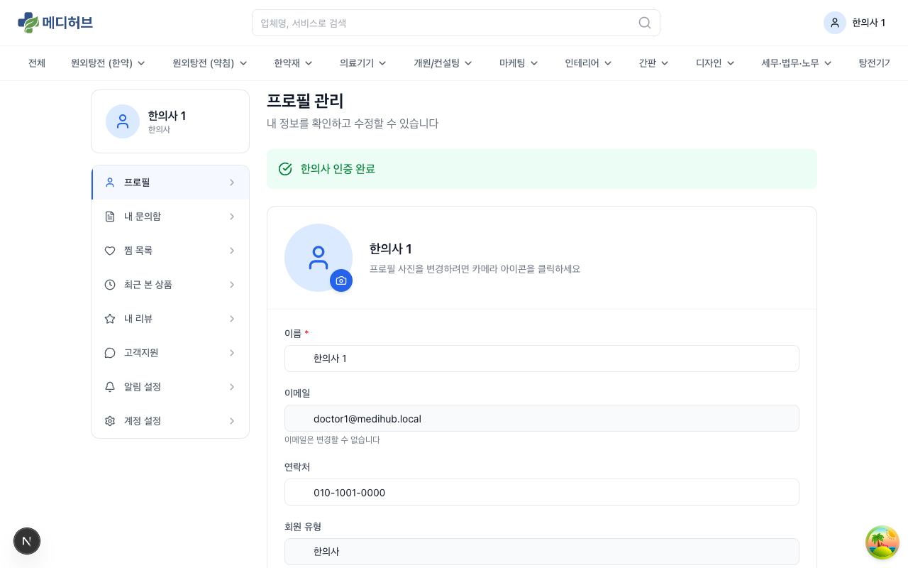

### 1-2. 사이드바 메뉴 구성

| 메뉴 | 설명 |
|------|------|
| **프로필** | 내 정보 확인 및 수정 |
| **내 문의함** | 내가 보낸 문의(리드) 목록 |
| **찜 목록** | 찜한 업체 관리 |
| **최근 본 상품** | 최근 조회한 업체/상품 기록 |
| **내 리뷰** | 내가 작성한 리뷰 관리 |
| **고객지원** | 1:1 문의 티켓 |
| **알림 설정** | 이메일 알림 on/off |
| **계정 설정** | 비밀번호 변경, 소셜 계정 연결 |

---

## 2. 프로필

### 2-1. 프로필 조회

마이페이지 첫 화면에서 내 프로필 정보를 확인할 수 있습니다.

**표시 정보:**
- **한의사 인증 상태**: 인증 완료 / 대기중 / 반려 표시
- **프로필 사진**: 카메라 아이콘 클릭으로 변경 가능
- **이름**: 실명
- **이메일**: 로그인 ID (변경 불가)
- **연락처**: 전화번호
- **회원 유형**: 한의사

### 2-2. 프로필 수정

1. 프로필 페이지에서 수정할 항목의 입력란을 변경
2. 하단의 **저장** 버튼 클릭

> 이메일은 로그인 ID이므로 변경할 수 없습니다.

### 2-3. 프로필 완성도

프로필 상단에 **프로필 완성도**가 표시될 수 있습니다. 다음 항목들을 완료하면 완성도가 올라갑니다:
- 인증 서류 제출
- 프로필 사진 등록
- 연락처 입력
- 첫 문의 발송
- 첫 리뷰 작성

---

## 3. 내 문의함 (리드)

### 3-1. 문의 목록

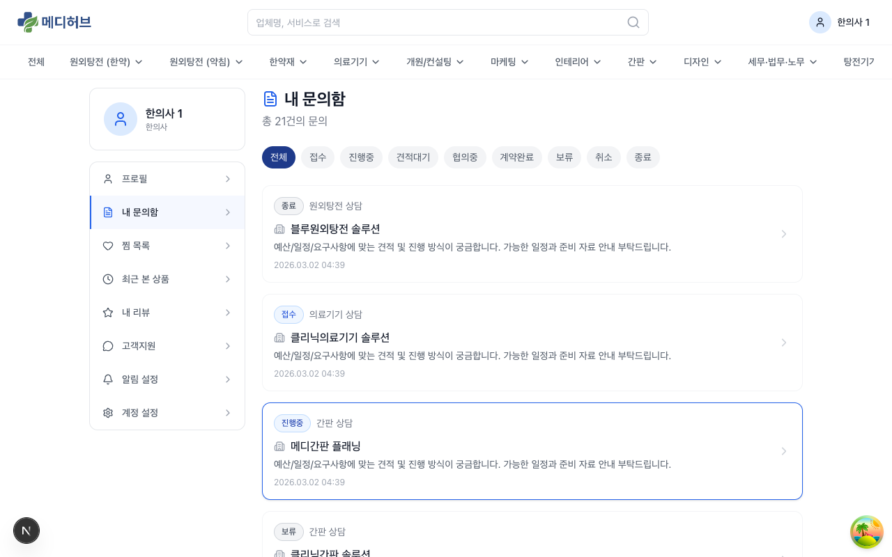

사이드바에서 **내 문의함**을 클릭하면 내가 보낸 문의(리드) 목록을 볼 수 있습니다.

**목록에서 확인 가능한 정보:**
- **상태**: 신청완료 / 진행중 / 견적대기 / 협의중 / 계약 / 보류 / 완료 / 취소
- **업체명**: 문의를 보낸 업체
- **서비스**: 문의한 서비스 카테고리
- **문의일**: 문의 제출 일시
- **최근 활동**: 마지막 상태 변경 또는 메시지 일시

**상태 필터:**
- 전체 / 진행중 / 완료 / 취소 등 상태별 필터 가능

### 3-2. 문의 상세

목록에서 문의를 클릭하면 상세 페이지로 이동합니다.

**상세 페이지 구성:**
- **문의 정보**: 업체명, 서비스, 연락처, 문의 내용
- **상태 이력**: 상태 변경 타임라인
- **Q&A 스레드**: 업체와의 질문/답변 대화
- **견적 정보**: 업체가 제출한 견적
- **첨부 파일**: 문의 시 첨부한 파일 및 업체 첨부 파일
- **메모**: 개인 메모 기록 가능

### 3-3. 문의 상태 흐름

```
신청완료 → 진행중 → 견적대기 → 협의중 → 계약 → 완료
                                           ↘ 보류
                                           ↘ 취소
```

### 3-4. 문의 취소

- 진행 전 상태의 문의는 **취소** 가능
- 취소 시 취소 사유 입력
- 취소된 문의는 목록에서 **취소** 상태로 표시

> 업체가 무응답(72시간)인 리드는 자동으로 크레딧이 복구되며, 한의사에게 알림이 발송됩니다.

---

## 4. 찜 목록

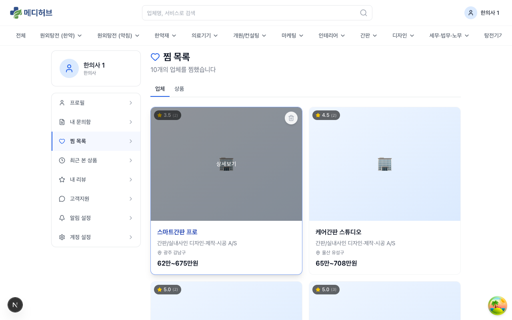

### 4-1. 찜 목록 조회

사이드바에서 **찜 목록**을 클릭하면 찜한 업체 목록을 확인할 수 있습니다.

- 찜한 업체들이 카드 형태로 표시
- 각 카드에서 **하트 아이콘** 클릭으로 찜 해제 가능
- 카드 클릭 시 업체 상세 페이지로 이동

---

## 5. 최근 본 상품

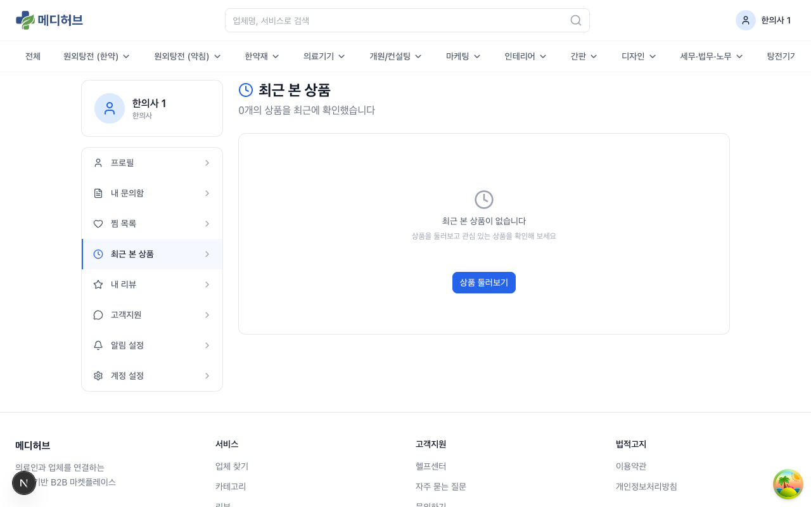

- 최근 90일간 조회한 업체/상품이 자동 기록
- 삭제 / 전체삭제 가능
- 비로그인 시에는 로컬 저장 → 로그인 시 병합

---

## 6. 내 리뷰

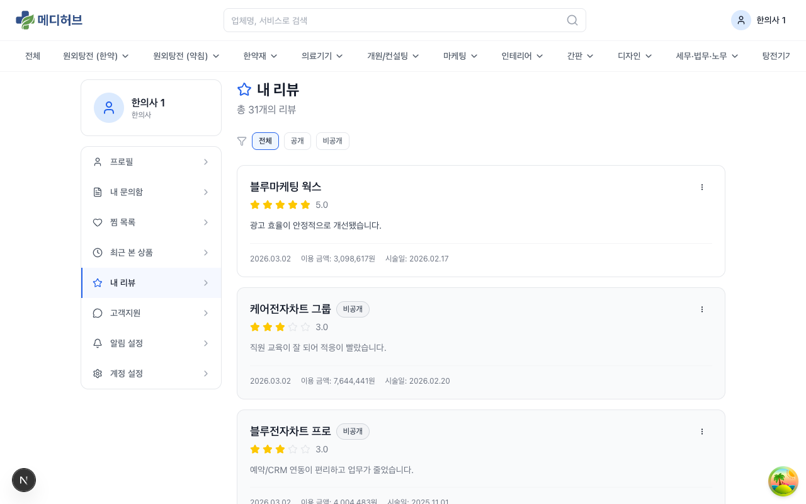

### 6-1. 리뷰 목록

내가 작성한 리뷰 목록을 확인할 수 있습니다.

**리뷰 표시 정보:**
- 업체명 / 카테고리
- 별점 (전체 + 세부 항목)
- 리뷰 내용
- 작성일

### 6-2. 리뷰 작성

리뷰는 업체 상세 페이지의 **리뷰 탭**에서 작성합니다.

**리뷰 작성 항목:**
- **전체 평점**: 1~5점 별점
- **세부 평점**: 품질, 소통, 속도 각각 평가
- **리뷰 내용**: 텍스트 작성
- **사진 첨부**: 리뷰 사진 업로드 가능

### 6-3. 리뷰 관리

- **수정**: 작성한 리뷰의 내용/평점 수정
- **삭제**: 리뷰 삭제
- **비공개 전환**: 리뷰를 비공개로 전환 (다른 사용자에게 미노출)

> 리뷰 작성 및 노출 기준은 **리뷰 정책** (`/legal/review-policy`)에서 확인할 수 있습니다.

---

## 7. 고객지원

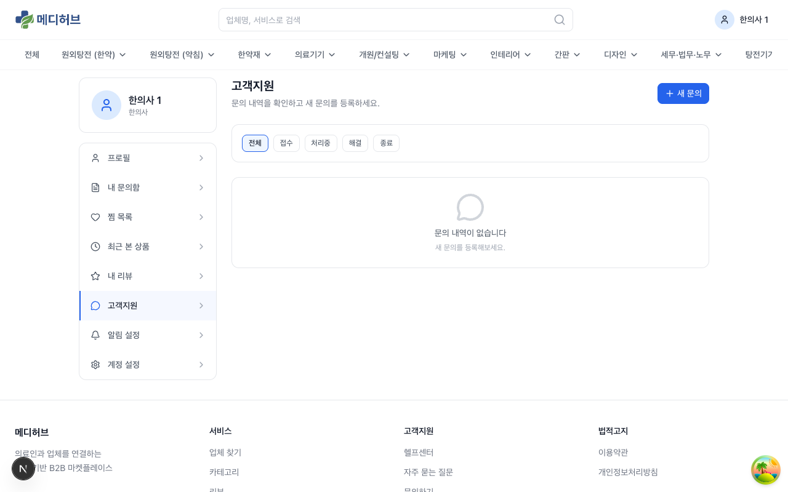

### 7-1. 1:1 문의 티켓

사이드바에서 **고객지원**을 클릭하면 1:1 문의 티켓 목록을 확인할 수 있습니다.

### 7-2. 새 문의 작성

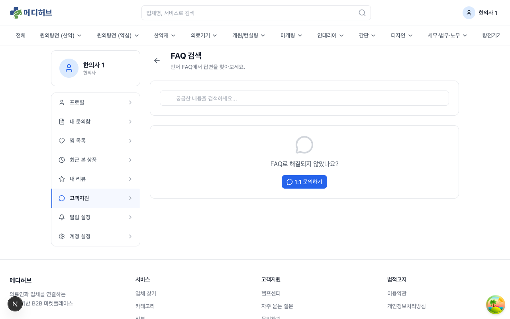

1. **새 문의** 버튼 클릭
2. **카테고리** 선택 (계정, 결제, 서비스, 기타 등)
3. **제목** 입력
4. **내용** 입력
5. **첨부 파일** 추가 (선택)
6. **제출** 버튼 클릭

### 7-3. 티켓 상태

- **접수**: 문의가 접수된 상태
- **처리중**: 관리자가 확인하고 처리 중
- **완료**: 답변 완료
- **종료**: 처리 완료 후 종료

---

## 8. 알림 설정

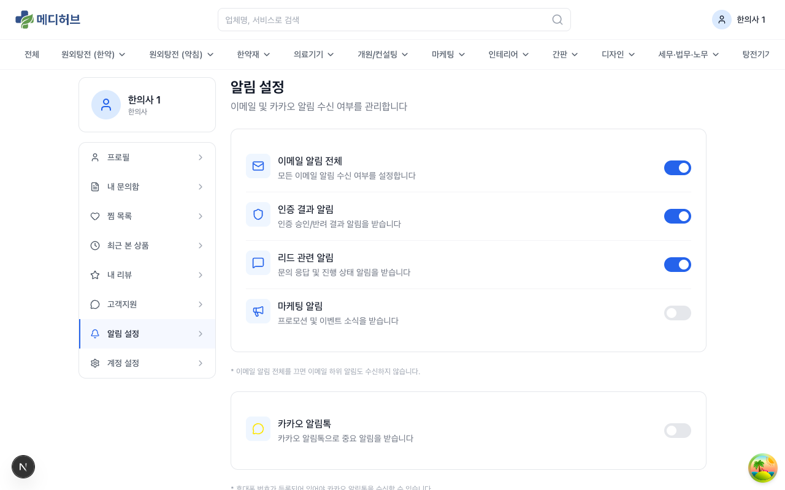

### 8-1. 알림 종류

| 알림 항목 | 설명 |
|---------|------|
| **이메일 알림 전체** | 모든 이메일 알림 on/off |
| **인증 결과 알림** | 한의사 인증 승인/반려 결과 |
| **리드 관련 알림** | 문의 상태 변경, 업체 응답, 견적 도착 등 |
| **마케팅 알림** | 프로모션 및 마케팅 정보 수신 |

### 8-2. 알림 설정 변경

각 항목의 **토글 스위치**를 클릭하여 on/off 전환 가능합니다.

> 마케팅 알림은 **마케팅 수신동의**에 해당하며, 언제든 철회할 수 있습니다.

---

## 9. 계정 설정

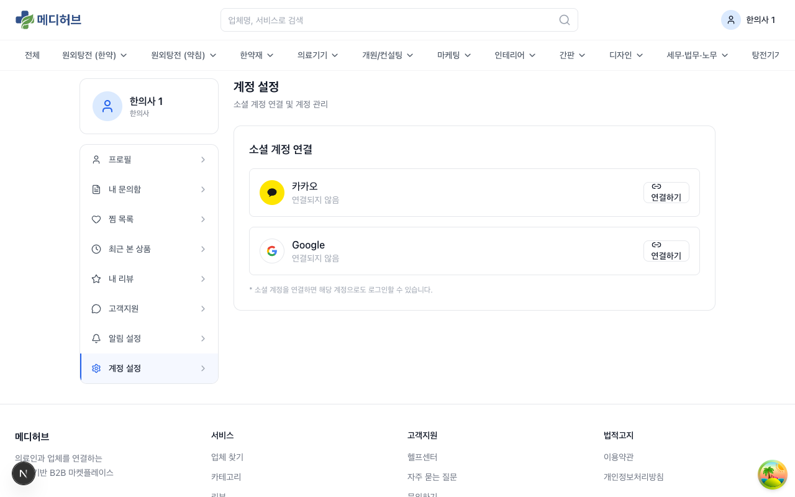

### 9-1. 소셜 계정 연결

- **카카오**: 연결하기 / 연결 해제
- **Google**: 연결하기 / 연결 해제

소셜 계정을 연결하면 해당 소셜 서비스로도 로그인할 수 있습니다.

> 소셜 계정을 연결하려면 **연결하기** 버튼 클릭 → 해당 소셜 서비스 인증 → 자동 복귀하여 연결 완료

### 9-2. 비밀번호 변경

계정 설정 페이지 또는 별도의 비밀번호 변경 기능에서 현재 비밀번호를 확인한 후 새 비밀번호로 변경할 수 있습니다.

---

## 10. 인테리어 비딩 (프로젝트 등록)

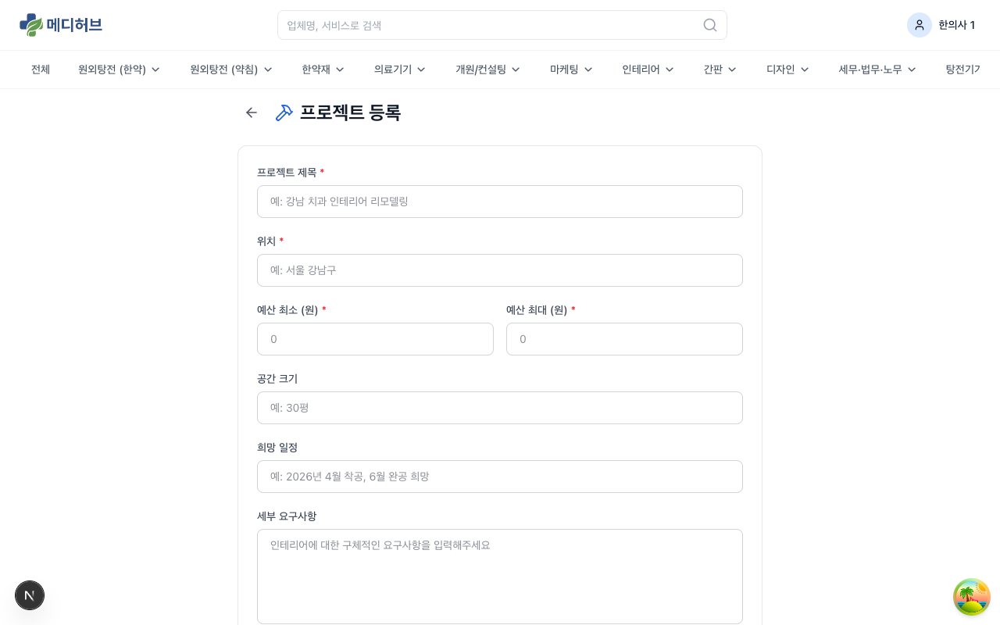

### 10-1. 프로젝트 등록

1. 메인 페이지에서 **인테리어** 카테고리 클릭
2. **프로젝트 등록** 버튼 클릭
3. 프로젝트 정보 입력:
   - **제목**: 프로젝트 이름
   - **설명**: 상세 요구사항
   - **예산 범위**: 예상 예산
   - **일정**: 희망 시공 일정
   - **지역**: 시공 위치
   - **첨부 파일**: 도면, 참고 이미지 등

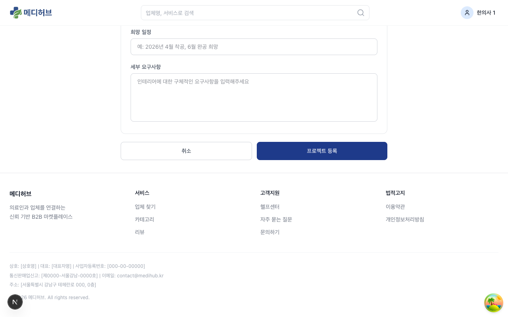

### 10-2. 입찰 확인

프로젝트 등록 후:
1. 시스템이 조건에 맞는 업체를 자동 매칭 (최대 3개)
2. 매칭된 업체에게 입찰 요청이 발송됨
3. 업체가 견적을 제출하면 알림 수신
4. **마이페이지 > 내 문의함** 또는 인테리어 페이지에서 입찰 현황 확인

### 10-3. 업체 선정

1. 제출된 견적들을 비교
2. 원하는 업체를 **선정** 버튼으로 선택
3. 계약 프로세스 진행
