# 업체 파트너센터 가이드

> 업체(Vendor) 역할의 파트너센터 기능을 안내합니다. 업체 프로필, 상품 관리, 리드 관리, 크레딧, 광고, 구독, 입점 멤버십 등을 포함합니다.

---

## 1. 파트너센터 개요

### 1-1. 파트너센터 접근

업체 계정으로 로그인 후, 우측 상단 사용자 메뉴에서 **파트너센터**로 이동합니다.

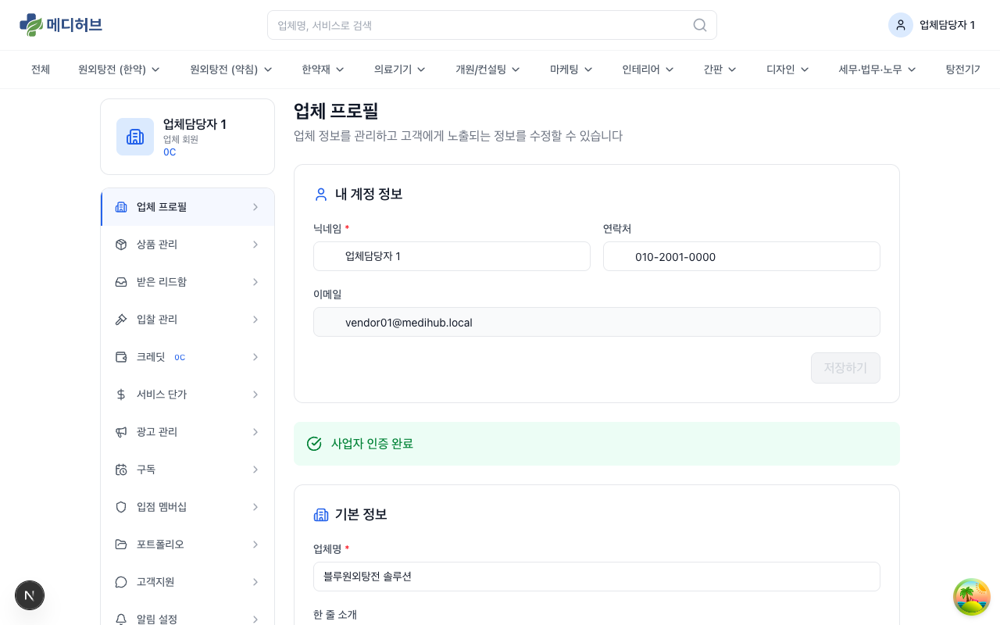

### 1-2. 사이드바 메뉴 구성

| 메뉴 | 설명 |
|------|------|
| **업체 프로필** | 업체 정보 및 인증 상태 관리 |
| **상품 관리** | 서비스 상품 등록/관리 |
| **받은 리드함** | 한의사로부터 받은 문의 관리 |
| **입찰 관리** | 인테리어 비딩 입찰 관리 |
| **크레딧** | 크레딧 잔액 조회, 충전, 거래내역 (헤더에 잔액 표시) |
| **서비스 단가** | 카테고리별 서비스 단가 설정 |
| **광고 관리** | 우선순위 노출 광고 구매/관리 |
| **구독** | 기간제 무제한 리드 수신 구독 |
| **입점 멤버십** | S등급 업종 연회비 관리 |
| **포트폴리오** | 시공/작업 사례 관리 |
| **고객지원** | 1:1 문의 티켓 |
| **알림 설정** | 이메일 알림 on/off |
| **계정 설정** | 비밀번호, 소셜 계정 연결 |

> 사이드바 상단에 **크레딧 잔액**(예: 0C)이 실시간으로 표시됩니다.

---

## 2. 업체 프로필

### 2-1. 프로필 조회

파트너센터 첫 화면에서 업체 프로필 정보를 확인할 수 있습니다.

**표시 정보:**
- **내 역할 정보**: 업체담당자명, 연락처
- **사업자 인증 상태**: 인증 완료 / 대기중 / 반려
- **기본 정보**: 업체명, 대표자명, 사업자등록번호 등

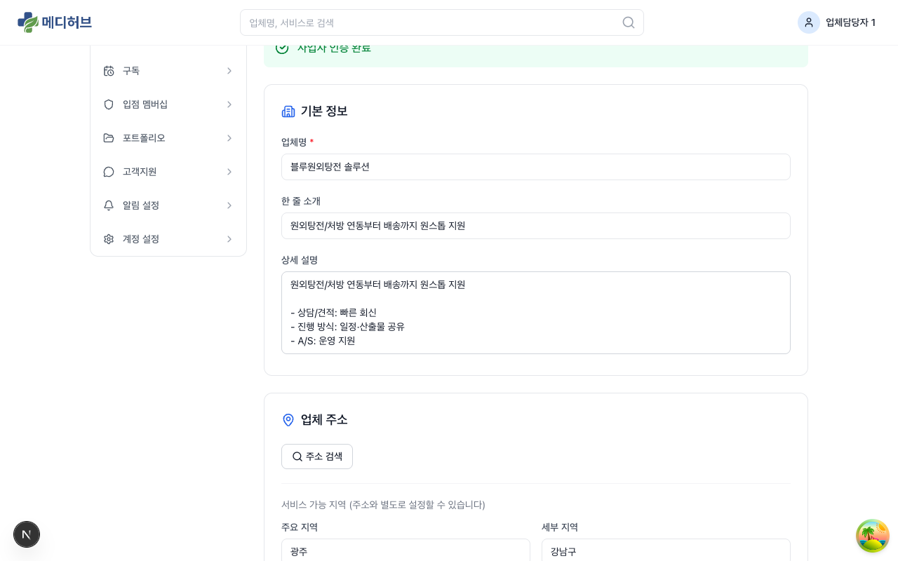

### 2-2. 프로필 수정

1. 수정할 항목의 입력란을 변경
2. **저장** 버튼 클릭

**수정 가능 항목:**
- 업체명 / 1줄 소개
- 서비스 소개 (리치텍스트 지원 - 마크다운/HTML)
- 대표 이미지
- 서비스 지역 (시/도, 시/군/구)
- 가격 범위
- 연락처 / 이메일

---

## 3. 상품 관리

### 3-1. 상품 목록

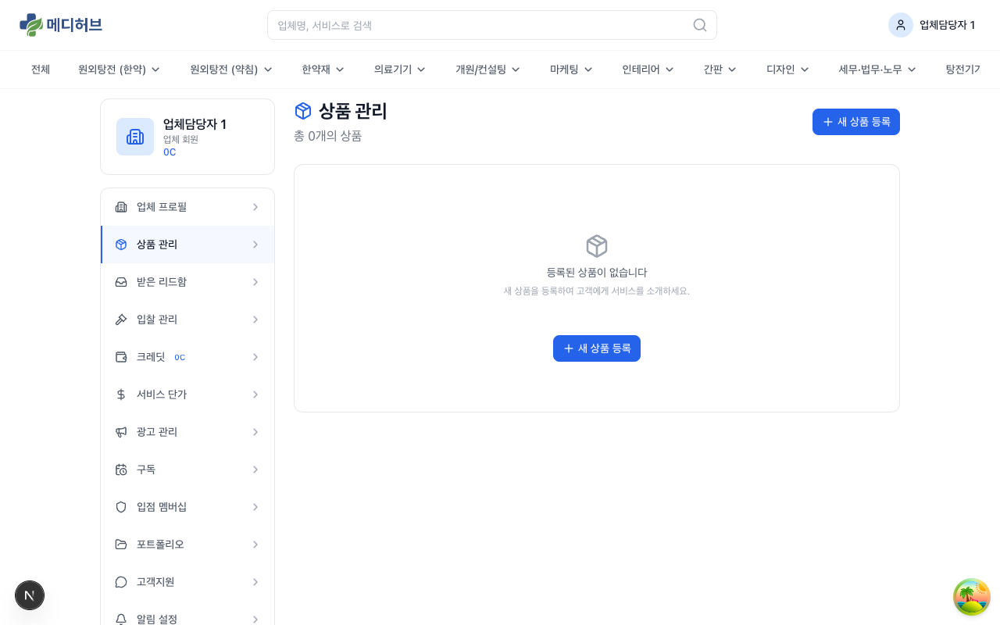

사이드바에서 **상품 관리**를 클릭하면 등록한 상품 목록을 확인할 수 있습니다.

### 3-2. 새 상품 등록

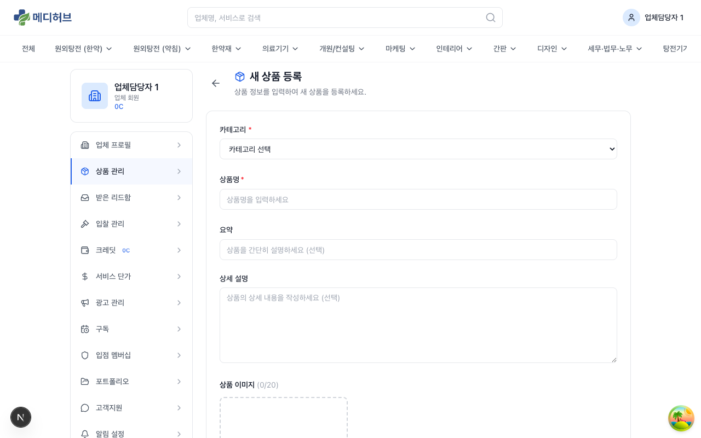

1. **+ 새 상품 등록** 버튼 클릭
2. 상품 정보 입력:
   - **상품명**: 서비스/상품 이름
   - **카테고리**: 해당 카테고리 선택
   - **설명**: 상품 상세 설명
   - **가격 정보**: 가격대 입력
   - **이미지**: 상품 이미지 업로드
3. **등록** 버튼 클릭

### 3-3. 상품 수정/삭제

- 상품 목록에서 해당 상품 클릭 → 수정 화면
- 수정 후 **저장** 또는 **삭제** 가능

---

## 4. 받은 리드함

### 4-1. 리드 목록

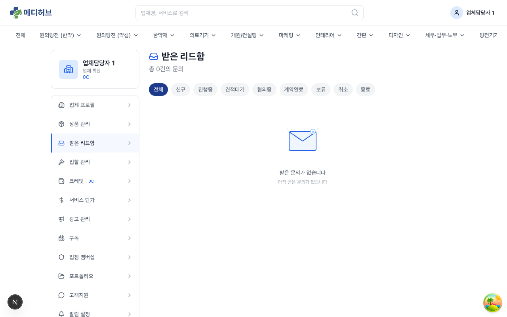

사이드바에서 **받은 리드함**을 클릭하면 한의사로부터 받은 문의(리드) 목록을 확인할 수 있습니다.

**상태 탭 필터:**
- **전체**: 모든 리드
- **신규**: 아직 확인하지 않은 리드
- **진행중**: 응답/견적 진행 중인 리드
- **견적대기**: 견적을 제출하고 응답 대기 중
- **협의중**: 한의사와 협의 진행 중
- **계약완료**: 계약이 확정된 리드
- **보류 / 취소 / 종료**: 보류되거나 종료된 리드

### 4-2. 리드 상세

리드를 클릭하면 상세 페이지로 이동합니다.

**상세 페이지 구성:**
- **문의 정보**: 한의사명, 연락처, 소속, 문의 서비스, 문의 내용
- **상태 변경**: 드롭다운으로 상태 전환
- **Q&A 스레드**: 한의사에게 질문/답변 가능
- **견적 제출**: 견적 금액 및 상세 내용 작성
- **첨부 파일**: 견적서(PDF) 등 업로드
- **체크리스트**: 처리 항목 관리

### 4-3. 리드 과금

> 리드를 수신하면 **크레딧이 자동 차감**됩니다.

- 차감 금액은 **서비스 단가**에서 설정한 카테고리별 단가 기준
- 복수 서비스 문의 시 단가 합산
- **30일 이내 동일 한의사 → 동일 업체 중복 리드**는 무료 처리

> 자세한 과금 정책은 [05-수익화-과금-가이드](05-수익화-과금-가이드.md)를 참조하세요.

### 4-4. 무응답 처리

| 경과 시간 | 처리 |
|---------|------|
| **48시간** | 카카오톡 알림 발송 (무응답 경고) |
| **72시간** | 자동 크레딧 복구 + 리드 종료 |

### 4-5. 리드 신고

허위/스팸 리드인 경우:
1. 리드 상세에서 **신고** 버튼 클릭
2. 신고 사유 입력
3. 관리자 심사 → 확인 시 크레딧 복구

---

## 5. 입찰 관리 (비딩)

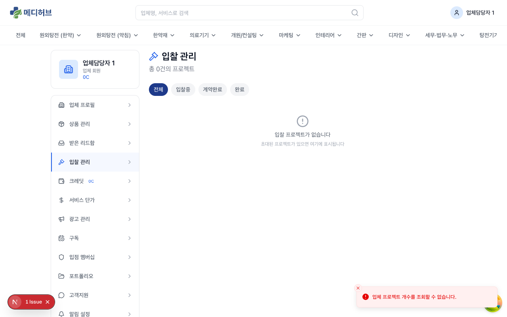

### 5-1. 입찰 요청 확인

인테리어 비딩 시스템에서 매칭된 프로젝트가 있으면 입찰 요청이 들어옵니다.

### 5-2. 견적 제출

1. 입찰 요청 상세 확인 (프로젝트 요구사항, 예산, 일정)
2. **견적 제출** 버튼 클릭
3. 견적 금액, 시공 일정, 상세 제안 입력
4. 제출 완료

### 5-3. 선정 결과

- 한의사가 업체를 선정하면 알림 수신
- 선정 시 계약 프로세스 진행 (수수료 3%)

---

## 6. 크레딧

### 6-1. 잔액 조회

사이드바에서 **크레딧**을 클릭하면 크레딧 관리 페이지로 이동합니다.

**표시 정보:**
- **현재 잔액**: 사용 가능한 크레딧 잔액
- **자동충전 설정**: 자동충전 on/off 상태

### 6-2. 크레딧 충전

1. **충전하기** 버튼 클릭
2. 충전 패키지 선택 (예: 10만원 / 30만원 / 50만원 / 100만원)
3. **TossPayments 결제 위젯**으로 결제 진행
4. 결제 완료 시 크레딧 즉시 충전

> 자동충전 설정 시 잔액이 설정 금액 이하로 떨어지면 자동으로 충전됩니다. 자동충전 시 **2% 보너스 크레딧**이 추가 지급됩니다.

### 6-3. 거래 내역

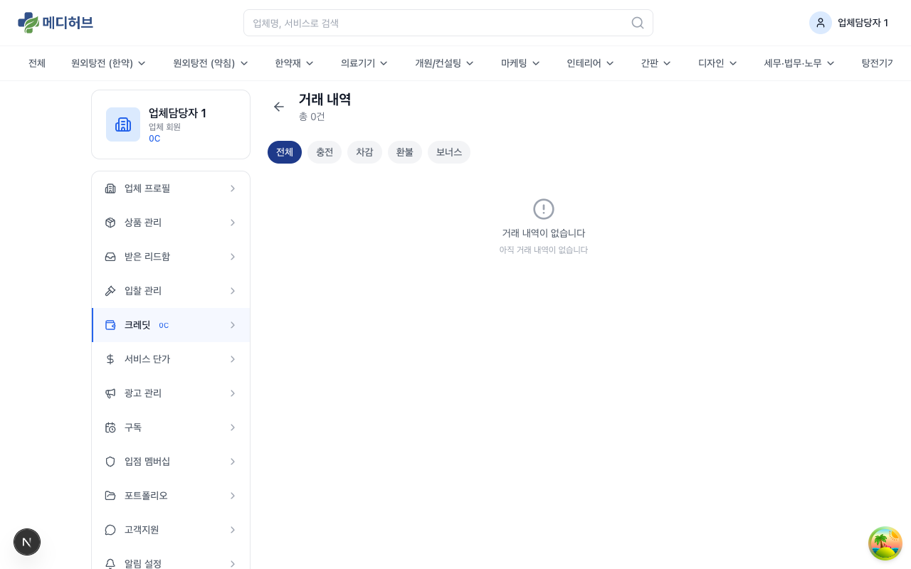

- 크레딧 충전/차감/복구 이력을 시간순으로 확인
- 각 거래의 **유형** (충전, 리드차감, 리드복구, 구독차감, 광고차감 등), **금액**, **잔액**, **일시** 표시

> 크레딧 유효기간은 **12개월**입니다.

---

## 7. 서비스 단가 설정

### 7-1. 단가 설정

사이드바에서 **서비스 단가**를 클릭하면 카테고리별 서비스 단가를 설정할 수 있습니다.

1. **단가 추가** 버튼 클릭
2. 카테고리 선택 (업체가 등록한 카테고리 중 선택)
3. 단가 입력 (1만원 ~ 20만원)
4. **저장** 클릭

> 서비스 단가를 설정하지 않은 카테고리로는 리드를 수신할 수 없습니다. 반드시 단가를 설정해야 리드가 전달됩니다.

### 7-2. 단가 수정/삭제

- 설정된 단가를 클릭하여 수정 가능
- 불필요한 카테고리의 단가 삭제 가능

---

## 8. 광고 관리

### 8-1. 우선순위 노출 광고

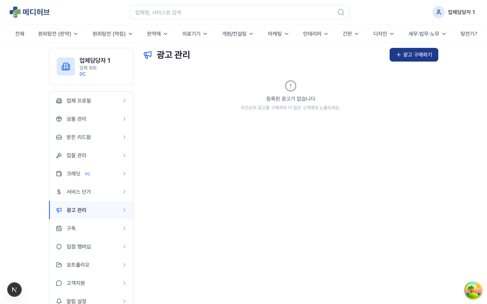

카테고리 페이지에서 **상위 노출**되는 유료 광고입니다.

### 8-2. 광고 구매

1. **광고 구매** 버튼 클릭
2. **카테고리 선택**: 광고를 노출할 카테고리
3. **등급 선택**:

| 등급 | 가격 (주당) | 혜택 |
|------|----------|------|
| **프리미엄** | 30만원 | 최상단 노출, 배경 강조 |
| **플러스업** | 21만원 | 상위 2번째 줄 노출 |
| **플러스** | 6만원 | 상위 3번째 줄 노출 |
| **루키** | 3만원 | 4번째 줄 + 점프업 3회 |

4. 크레딧으로 결제
5. 구매 즉시 광고 적용

### 8-3. 루키 점프업

루키 등급 구매 시 기간 내 **3회 점프업** 가능:
- 1일 1회 사용 가능
- 사용 시 30분간 **프리미엄 위**에 노출
- 광고 관리 페이지에서 **점프업** 버튼 클릭

---

## 9. 구독 관리

### 9-1. 기간제 구독이란?

구독 기간 동안 해당 카테고리의 **리드를 무제한 무료**로 수신할 수 있습니다. (건별 크레딧 차감 없음)

### 9-2. 구독 구매

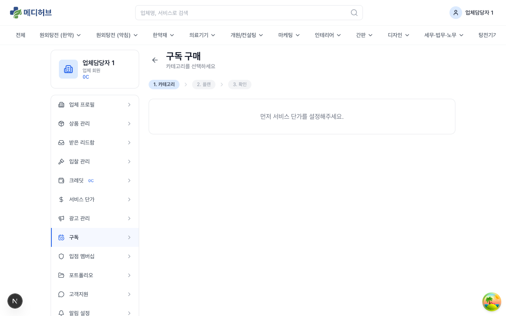

1. **구독 시작하기** 또는 **구독 추가** 버튼 클릭
2. 카테고리 선택
3. 구독 기간 선택:

| 기간 | 설명 |
|------|------|
| **30일** | 1개월 무제한 |
| **60일** | 2개월 무제한 |
| **90일** | 3개월 무제한 |
| **180일** | 6개월 무제한 |
| **365일** | 1년 무제한 |

4. 크레딧으로 결제

### 9-3. 구독 관리

- 활성 구독 목록에서 **만료일** 확인
- 만료 7일/1일 전 이메일 알림 발송
- 만료 전 **연장** 가능

---

## 10. 입점 멤버십

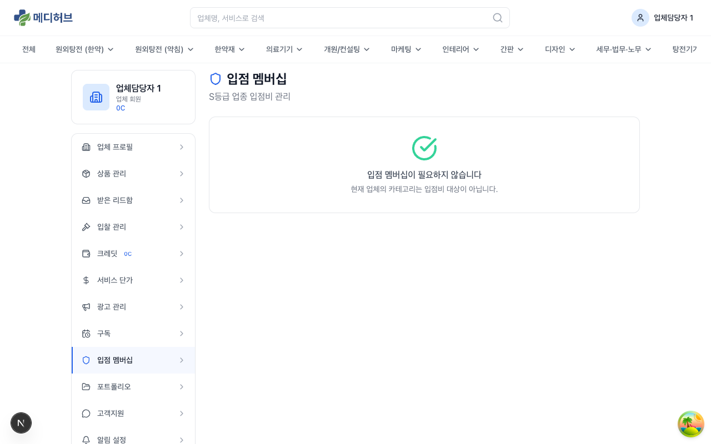

### 10-1. 입점 멤버십이란?

**S등급 업종**(원외탕전(한약), 원외탕전(약침), 약재회사/제약사)에 해당하는 업체는 **연회비(200만원)**를 납부해야 모든 기능을 이용할 수 있습니다.

### 10-2. 미납 시 제한

| 항목 | 미납 | 납부 |
|------|------|------|
| 기본 입점 | 가능 | 가능 |
| 검색 노출 | **하위 노출** | 정상 노출 |
| 리드 수신 | **차단** | 정상 수신 |
| 광고 구매 | 제한 | 가능 |

### 10-3. 연회비 납부

1. **입점 멤버십** 페이지에서 현재 상태 확인
2. **납부하기** 버튼 클릭
3. 크레딧으로 결제 (200만원)
4. 납부 완료 즉시 모든 기능 개방

> 만료 30일/7일 전에 이메일 알림이 발송됩니다.

---

## 11. 포트폴리오

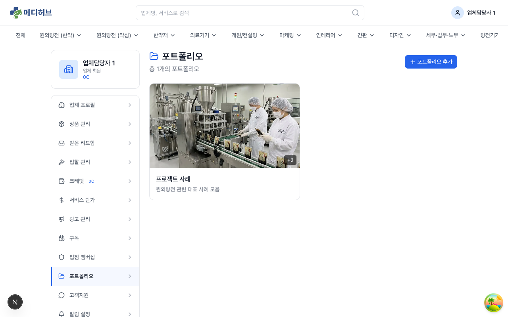

### 11-1. 포트폴리오 관리

업체의 시공/작업 사례를 등록하여 업체 상세 페이지에 노출합니다.

### 11-2. 포트폴리오 등록

1. **포트폴리오 추가** 버튼 클릭
2. 정보 입력:
   - **제목**: 사례 제목
   - **설명**: 작업 상세 설명
   - **태그**: 관련 키워드
   - **이미지**: 작업 사진 업로드 (다수 가능)
   - **대표 이미지 설정**: 가장 먼저 노출될 이미지 선택
3. **저장** 클릭

---

## 12. 고객지원 / 알림 설정 / 계정 설정

### 12-1. 고객지원

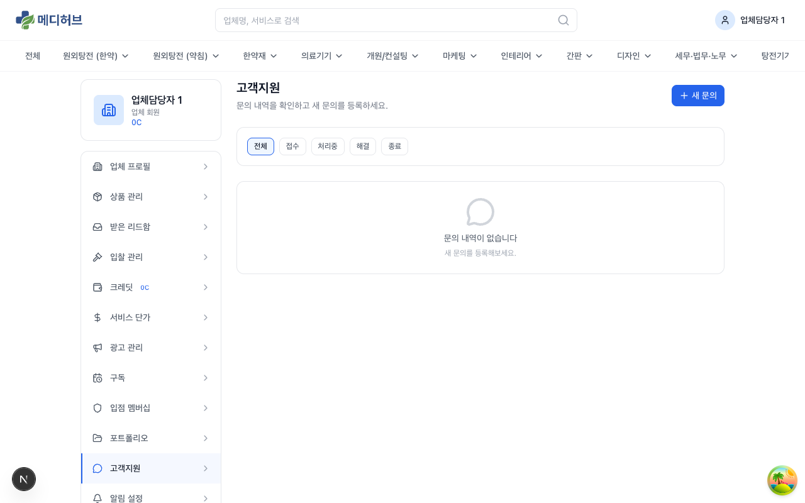

한의사 마이페이지의 고객지원과 동일한 1:1 문의 티켓 시스템입니다.

### 12-2. 알림 설정

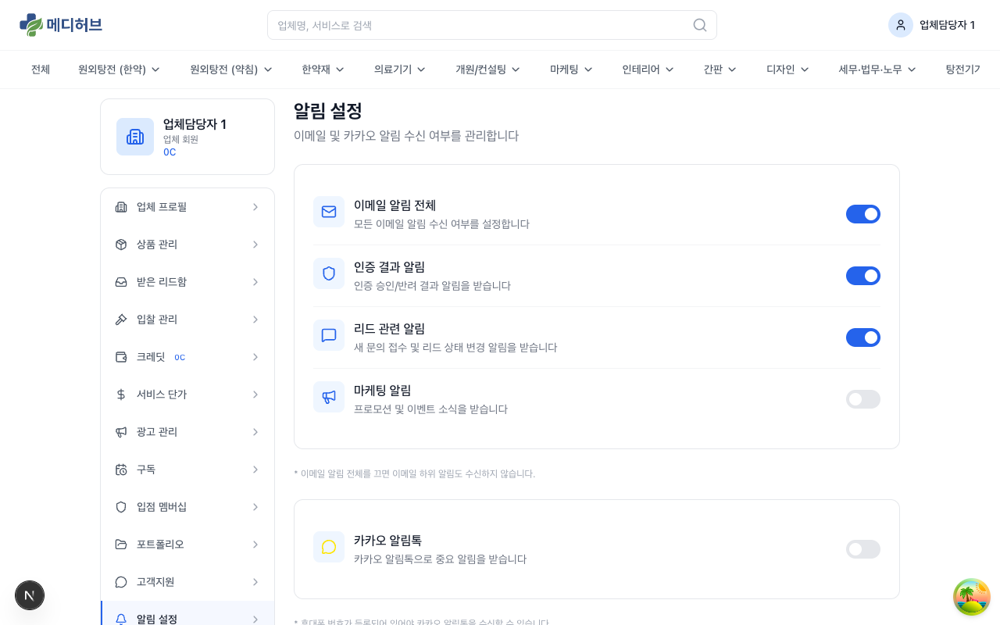

| 알림 항목 | 설명 |
|---------|------|
| **이메일 알림 전체** | 모든 이메일 알림 on/off |
| **인증 결과 알림** | 사업자 인증 승인/반려 |
| **리드 관련 알림** | 새 리드 수신, 상태 변경, 무응답 경고 |
| **마케팅 알림** | 프로모션 정보 |

### 12-3. 계정 설정

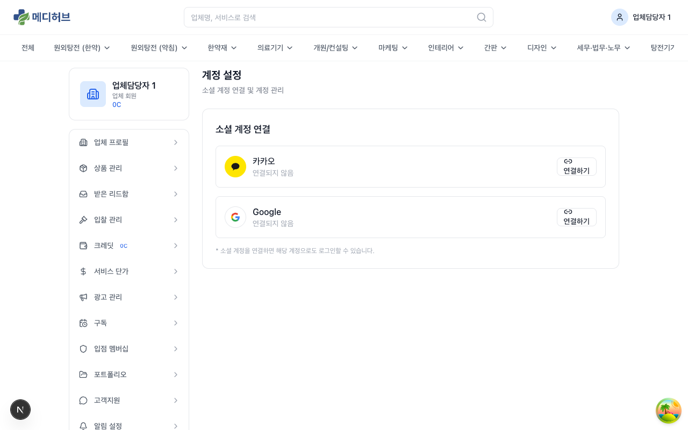

- **소셜 계정 연결**: 카카오 / Google 연결/해제
- **비밀번호 변경**
