# 관리자 가이드

> 관리자(Admin) 역할의 관리 기능을 안내합니다. 대시보드, 인증 승인, 사용자/업체 관리, 카테고리, 광고, 정산, 베타 운영 등을 포함합니다.

---

## 1. 관리자 대시보드

### 1-1. 대시보드 접근

관리자 계정으로 로그인 후 자동으로 관리자 페이지로 이동하거나, 사이드바에서 **대시보드**를 클릭합니다.

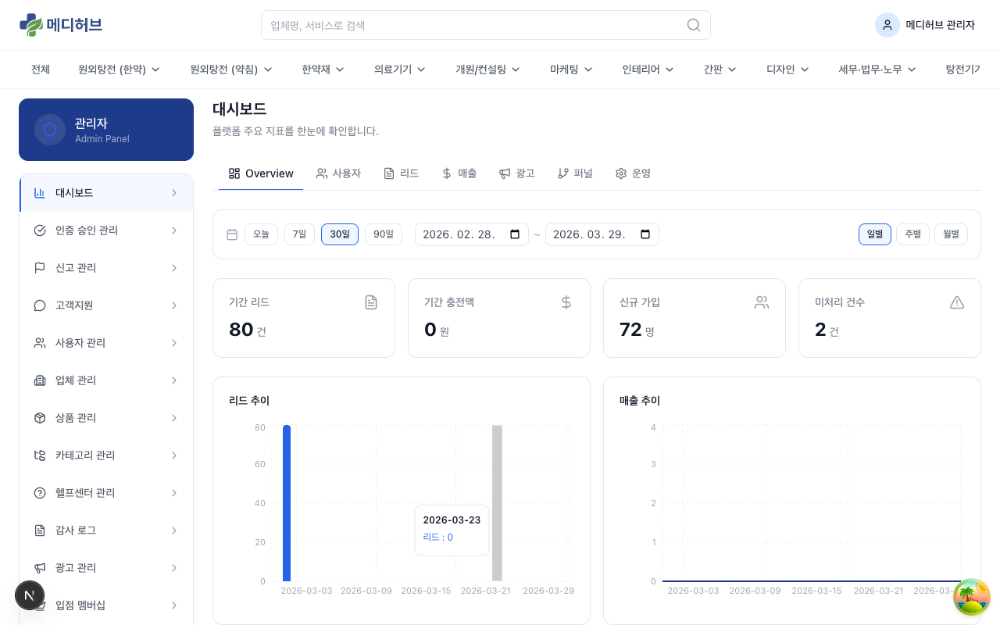

### 1-2. 대시보드 Overview

**상단 핵심 지표 카드:**
- **가입 사용자**: 전체 가입자 수
- **총 문의(리드)**: 전체 리드 수
- **활성 업체**: 인증 완료된 업체 수
- **총 결제**: 결제 건수

**차트 영역:**
- **리드 추이**: 기간별 리드 발생 추이 그래프
- **매출 추이**: 기간별 결제/매출 추이

### 1-3. 대시보드 탭

대시보드는 여러 탭으로 세부 분석을 제공합니다:

| 탭 | 내용 |
|------|------|
| **Overview** | 전체 핵심 지표 요약 |
| **사용자** | 가입자 추이, 역할별 분포, 인증 현황 |
| **리드** | 리드 발생/응답률/SLA, 상태 분포 |
| **매출** | 결제 금액, 크레딧 충전, 수익원별 분석 |
| **운영** | 응답률, SLA 준수율, 무응답 처리 현황 |
| **광고** | 배너/우선순위 광고 노출/클릭/CTR |
| **퍼널** | 가입→인증→리드→전환 퍼널 분석 |

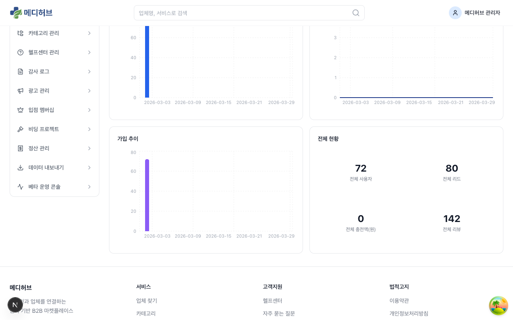

---

## 2. 인증 승인 관리

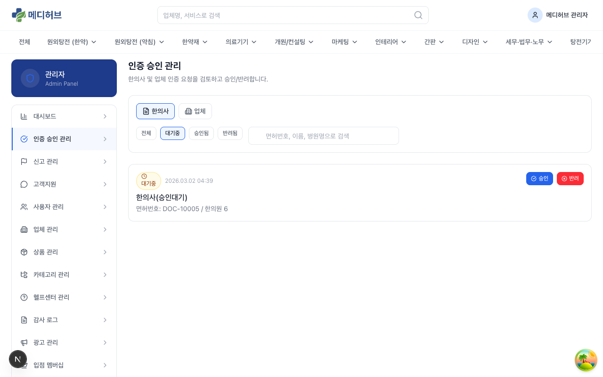

### 2-1. 승인 큐 확인

사이드바에서 **인증 승인 관리**를 클릭하면 인증 대기 중인 한의사/업체 목록이 표시됩니다.

**탭 필터:**
- **한의사**: 한의사 면허 인증 요청
- **업체**: 사업자 인증 요청

### 2-2. 인증 상세 확인

목록에서 항목을 클릭하면 상세 정보를 확인할 수 있습니다:

**한의사 인증 확인 항목:**
- 면허번호 / 성명 / 생년월일
- 소속 병원명
- 면허증 사진 (원본 확인 가능)

**업체 인증 확인 항목:**
- 사업자등록번호 / 대표자명
- 담당자 정보
- 사업자등록증 사진
- 등록 카테고리 / 지역

### 2-3. 승인 처리

1. 인증 정보 검토
2. **승인** 버튼 클릭
3. 승인 완료 → 해당 사용자에게 이메일 알림 발송
4. 사용자는 즉시 모든 기능 이용 가능

### 2-4. 반려 처리

1. 인증 정보 검토 후 문제 발견
2. **반려** 버튼 클릭
3. **반려 사유** 입력 (필수)
4. 반려 완료 → 해당 사용자에게 반려 사유와 함께 이메일 알림 발송
5. 사용자는 수정 후 재제출 가능

---

## 3. 신고 관리

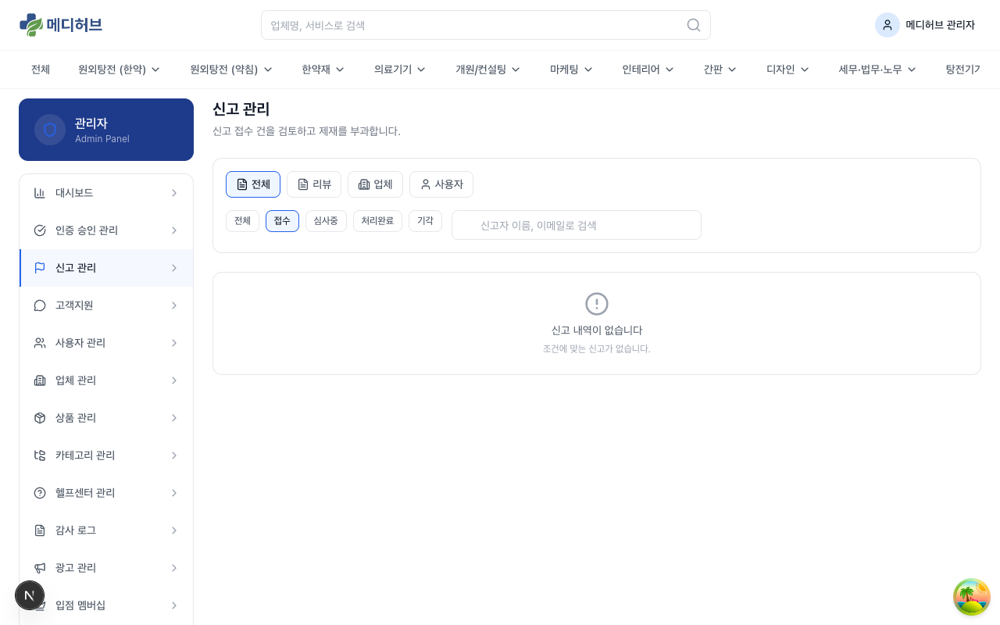

### 3-1. 리뷰 신고 목록

사용자가 신고한 리뷰 목록을 확인합니다.

### 3-2. 신고 처리

1. 신고된 리뷰 내용 확인
2. 신고 사유 확인
3. 처리 결정:
   - **블라인드**: 리뷰를 비공개 처리 (다른 사용자에게 미노출)
   - **복구**: 신고 기각, 리뷰 정상 노출 유지
   - **삭제**: 리뷰 완전 삭제

> 모든 신고 처리 이력은 **감사 로그**에 자동 기록됩니다.

---

## 4. 고객지원

### 4-1. 전체 티켓 관리

모든 사용자(한의사/업체)가 제출한 1:1 문의 티켓을 관리합니다.

**목록 정보:**
- 티켓 번호 / 제목
- 제출자 / 역할
- 카테고리
- 상태: 접수 / 처리중 / 완료 / 종료
- 제출일 / 최근 활동일

### 4-2. 티켓 응답

1. 티켓 클릭 → 상세 확인
2. **답변 입력** → 전송
3. 필요 시 **상태 변경** (처리중 → 완료)

---

## 5. 사용자 관리

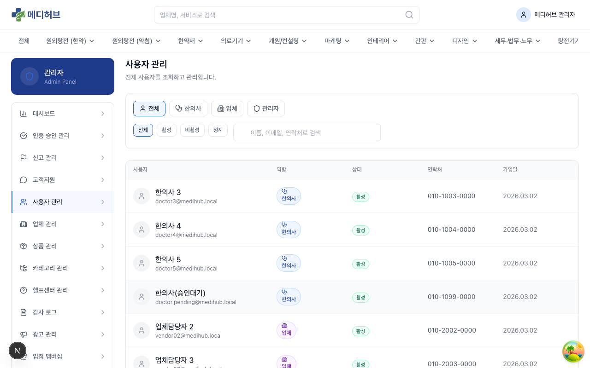

### 5-1. 사용자 목록

전체 사용자를 검색하고 관리합니다.

**검색/필터:**
- 이름 / 이메일 / 닉네임으로 검색
- 역할별 필터 (한의사 / 업체 / 관리자)
- 인증 상태별 필터

### 5-2. 사용자 상세

사용자를 클릭하면 상세 정보를 확인할 수 있습니다:
- 프로필 정보
- 가입일 / 최근 로그인일
- 인증 상태
- 활동 이력 (리드 수, 리뷰 수 등)

---

## 6. 업체 관리

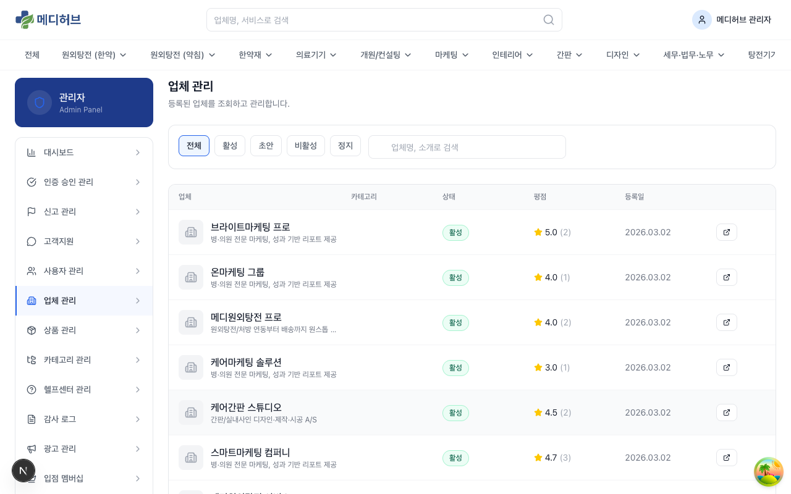

### 6-1. 업체 목록

등록된 모든 업체를 검색하고 관리합니다.

**검색/필터:**
- 업체명 / 담당자명으로 검색
- 카테고리별 필터
- 인증 상태별 필터
- 멤버십 상태 필터

### 6-2. 업체 상세

- 업체 프로필 정보
- 등록 카테고리
- 크레딧 잔액
- 구독/멤버십 상태
- 리드 수신 현황

---

## 7. 상품 관리

전체 상품(업체가 등록한 서비스)을 조회합니다.
- 상품명 / 업체명 / 카테고리 / 가격 / 등록일 표시
- 문제가 있는 상품에 대한 조치 가능

---

## 8. 카테고리 관리

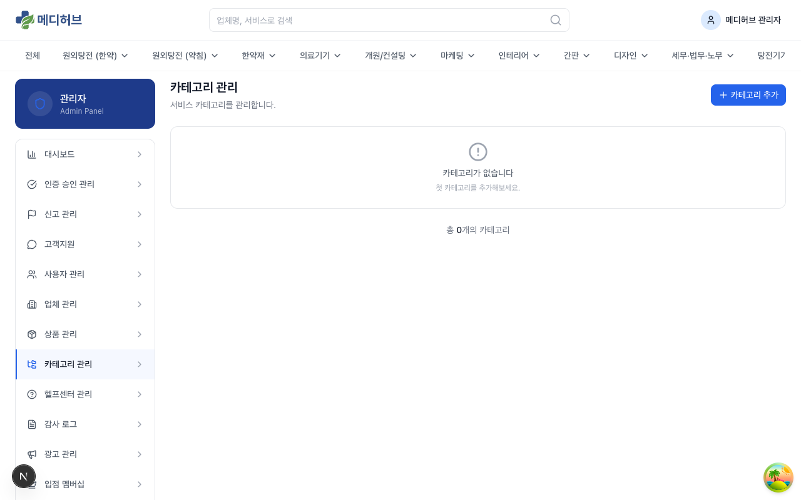

### 8-1. 카테고리 CRUD

서비스 카테고리를 관리합니다.

1. **+ 카테고리 추가** 버튼 클릭
2. 정보 입력:
   - **카테고리명**: 한글 이름
   - **슬러그**: URL 경로용 영문 이름
   - **상위 카테고리**: 대카테고리 선택 (없으면 최상위)
   - **아이콘**: 카테고리 아이콘
   - **정렬 순서**: 표시 순서
3. **저장** 클릭

### 8-2. 카테고리 트리

- **대카테고리**: 최상위 (예: 원외탕전, 의료기기)
- **중카테고리**: 대카테고리 하위 (예: 한약, 약침)
- **소카테고리**: 중카테고리 하위 (세부 분류)

> 카테고리 변경 시 해당 카테고리를 사용하는 업체/상품/광고에 영향이 있을 수 있습니다.

---

## 9. 헬프센터 관리

### 9-1. FAQ 관리

- FAQ 항목 추가/수정/삭제
- 카테고리별 분류
- 노출 순서 관리

### 9-2. 공지사항 관리

- 공지사항 작성/수정/삭제
- 작성일 / 수정일 자동 기록

---

## 10. 감사 로그

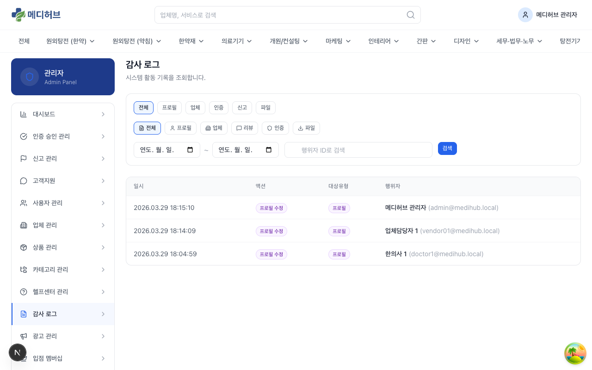

### 10-1. 감사 로그 조회

관리자의 모든 활동이 자동으로 기록됩니다.

**기록되는 활동:**
- 인증 승인/반려
- 리뷰 블라인드/복구/삭제
- 사용자 제재
- 카테고리 변경
- 환불 처리
- 크레딧 수동 지급/차감

**검색/필터:**
- 기간별 조회
- 관리자별 필터
- 활동 유형별 필터

---

## 11. 리드 리포트

리드(문의) 관련 통계를 확인합니다:
- 리드 발생 추이
- 업체별 응답률
- 무응답 처리 현황
- 신고/환불 현황

---

## 12. 광고 관리

### 12-1. 광고 Overview

광고 시스템 전반의 현황을 확인합니다.

### 12-2. 배너 캠페인 관리

**배너 광고 캠페인 CRUD:**

1. **캠페인 생성** 버튼 클릭
2. 캠페인 정보 입력:
   - **캠페인명**
   - **슬롯 타입**: 메인 배너 (200만/월) / 서브 배너 (120만/월)
   - **광고주**: 업체 선택
   - **기간**: 시작일 ~ 종료일
   - **크리에이티브**: 배너 이미지 + 클릭 URL
3. **저장** → 활성화

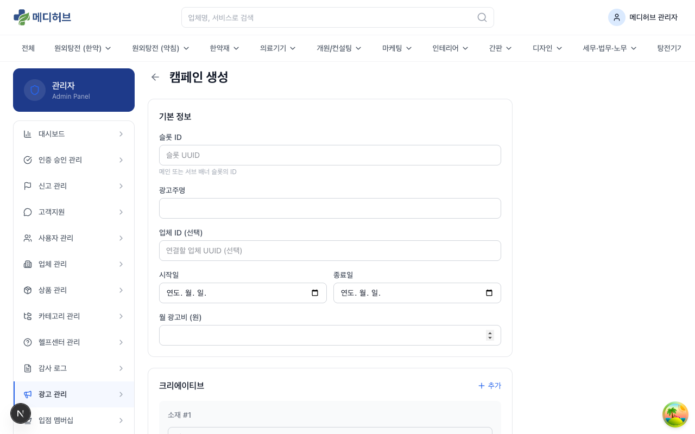

### 12-3. 우선순위 노출 현황

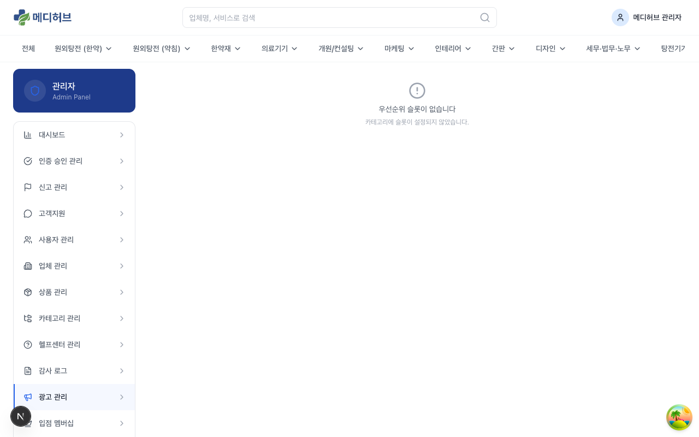

카테고리별 우선순위 광고 슬롯 현황을 확인합니다:
- 카테고리별 4등급 x 4슬롯 = 16개 슬롯
- 각 슬롯의 구매 업체, 기간, 상태

### 12-4. 광고 리포트

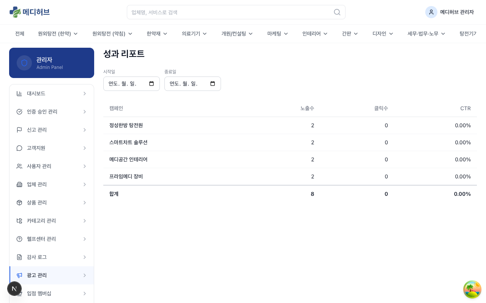

광고 성과를 확인합니다:
- 노출수 / 클릭수 / CTR (클릭률)
- 캠페인별 / 기간별 분석

---

## 13. 입점 멤버십 관리

### 13-1. 연회비 관리

S등급 업종 업체의 연회비 납부 현황을 관리합니다.

**관리 기능:**
- 업체별 납부 상태 확인
- 유효기간 확인
- **상태 변경**: 필요 시 멤버십 해지 처리

---

## 14. 비딩 프로젝트 관리

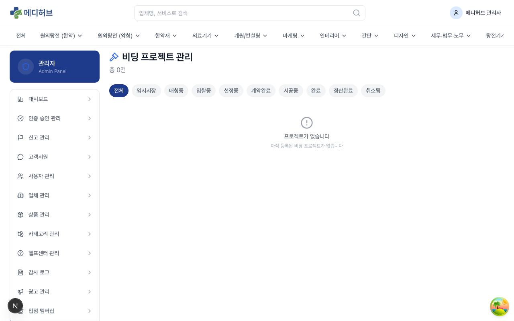

인테리어 비딩 프로젝트의 전체 현황을 관리합니다.
- 프로젝트 목록 및 상태 확인
- 분쟁 발생 시 상담/중재 대응

---

## 15. 정산 관리

### 15-1. 정산 목록

업체별 월별 정산을 관리합니다.

**상태 탭:**
- **전체**: 모든 정산
- **대기**: 생성되었으나 미확인
- **확인**: 관리자가 확인 완료
- **지급완료**: 실제 지급 처리 완료

**기능:**
- **정산 생성**: 월별 정산을 수동으로 생성 (또는 Cron 자동 생성)
- **CSV 내보내기**: 정산 데이터 엑셀 다운로드
- **정산 승인**: 정산 내역 검토 후 승인
- **지급 처리**: 승인된 정산의 실제 지급 처리

### 15-2. 정산 상세

정산을 클릭하면 상세 내역 확인:
- 업체 정보
- 정산 기간
- 항목별 금액 (리드 과금, 구독, 광고, 입점비 등)
- 수수료 / 최종 지급액

---

## 16. 환불 관리

### 16-1. 환불 요청 목록

업체가 제출한 환불 요청을 관리합니다.

### 16-2. 환불 심사

1. 환불 요청 상세 확인 (사유, 관련 리드 정보)
2. 심사 결정:
   - **승인**: 크레딧 복구 처리
   - **거절**: 거절 사유와 함께 통보

---

## 17. 데이터 내보내기

### 17-1. CSV Export

다음 데이터를 CSV 파일로 내보낼 수 있습니다:

| 항목 | 설명 |
|------|------|
| **결제 내역** | TossPayments 결제 이력 |
| **정산 내역** | 업체별 정산 데이터 |
| **리드 내역** | 전체 리드 발생/상태/과금 데이터 |

각 항목에서 **기간 설정** 후 **CSV 다운로드** 버튼 클릭.

---

## 18. 베타 운영 콘솔

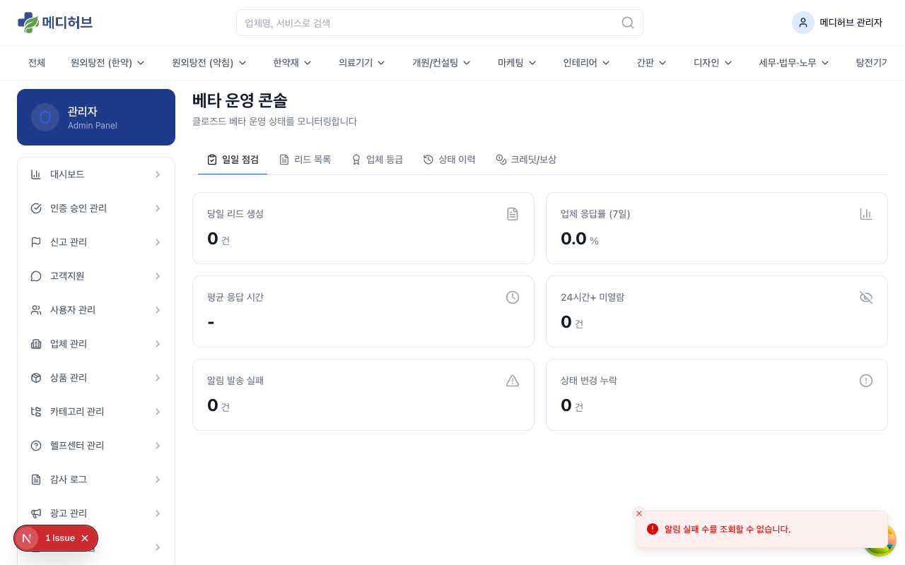

### 18-1. 베타 운영 개요

초기 운영/테스트 단계에서 활용하는 관리 도구입니다.

**대시보드 지표:**
- 베타 참여 업체 수
- 활성 리드 수
- 평균 응답 시간
- 24시간 내 미답변 건수

### 18-2. 베타 리드 관리

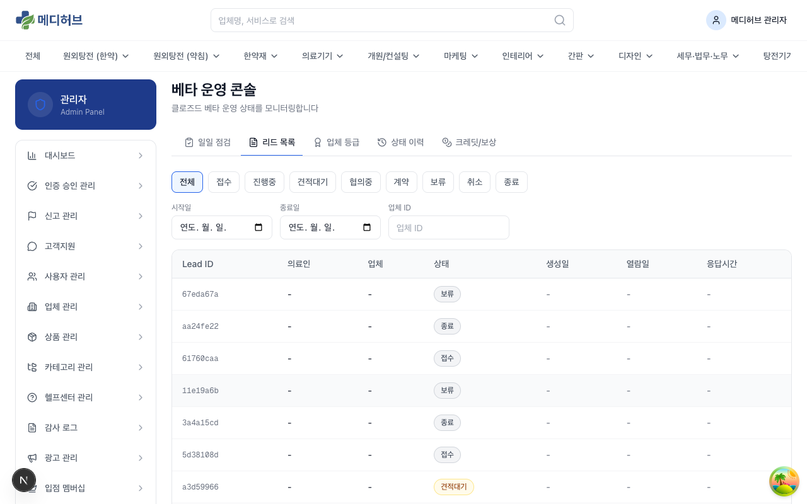

베타 기간 중 리드를 직접 관리/모니터링합니다.

### 18-3. 보상 관리

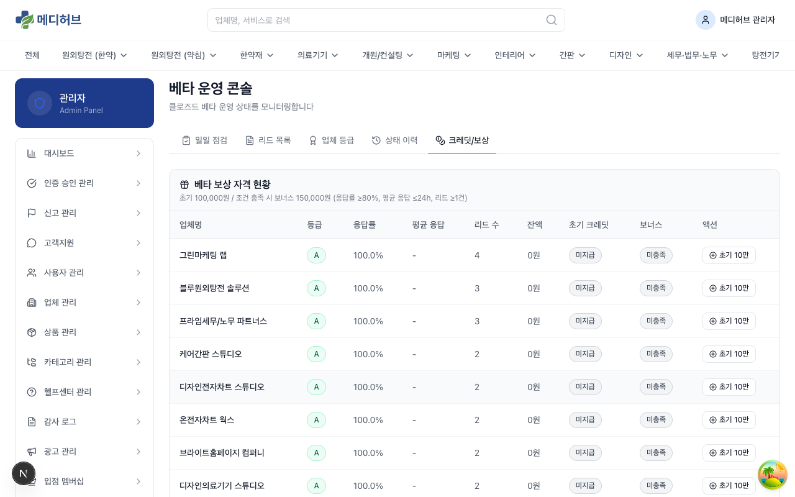

베타 참여 업체에 대한 보상 크레딧 지급을 관리합니다.

### 18-4. 업체 등급 관리

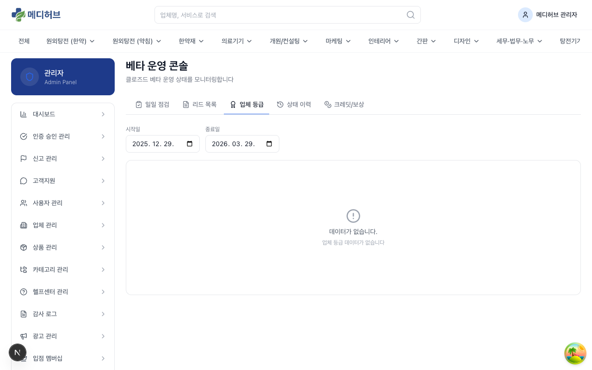

업체의 등급(S/A/B/C 등)을 설정하고 관리합니다.
- S등급: 입점비 대상 업종 (원외탕전, 약재)
- 등급에 따라 과금 정책 차등 적용

### 18-5. 수동 크레딧 지급/차감

관리자가 직접 업체의 크레딧을 지급하거나 차감할 수 있습니다.
- **지급**: 베타 보상, 프로모션, 오류 보상 등
- **차감**: 오입금 정정, 어뷰징 제재 등
- 모든 수동 조작은 **감사 로그**에 기록됩니다.
