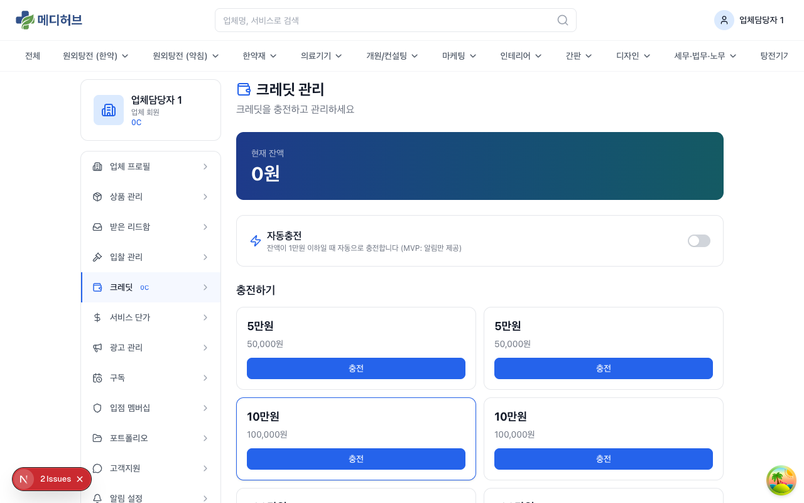
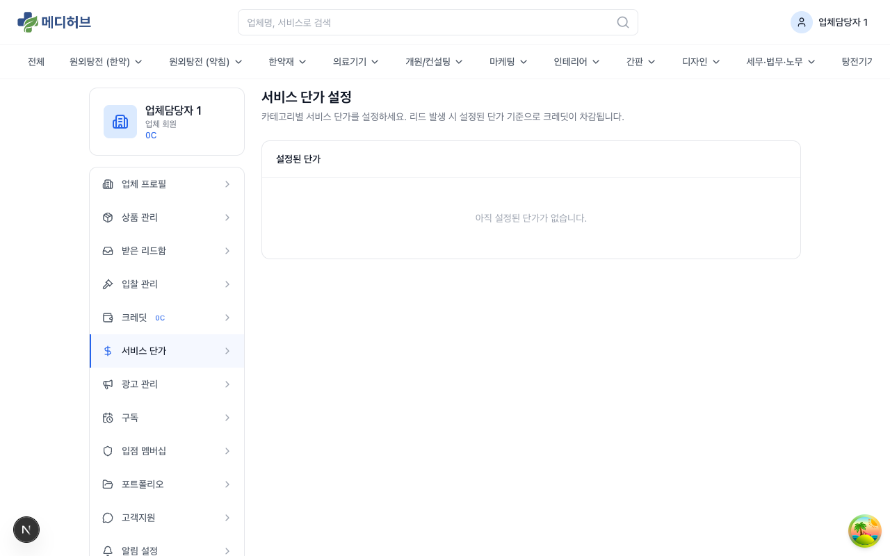
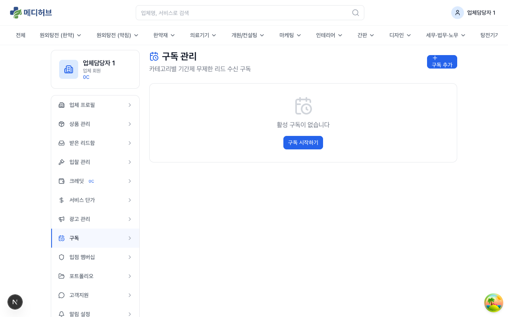
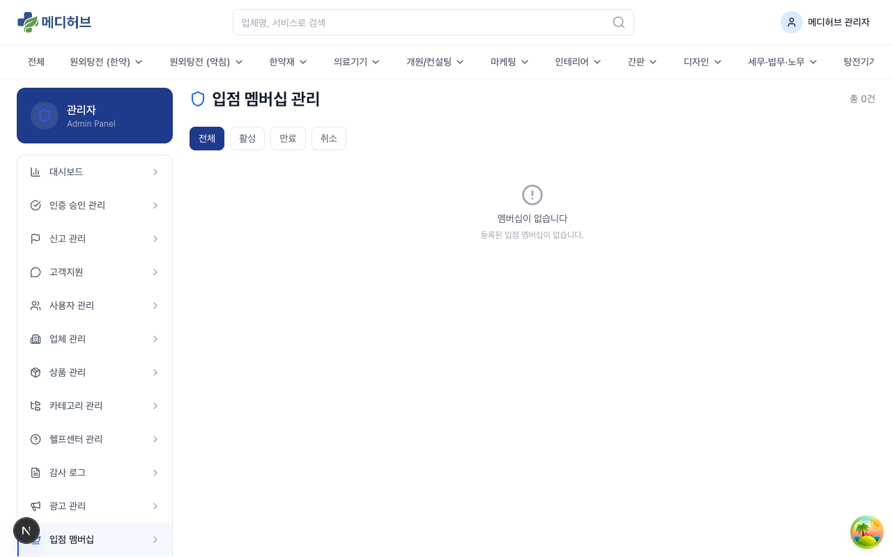
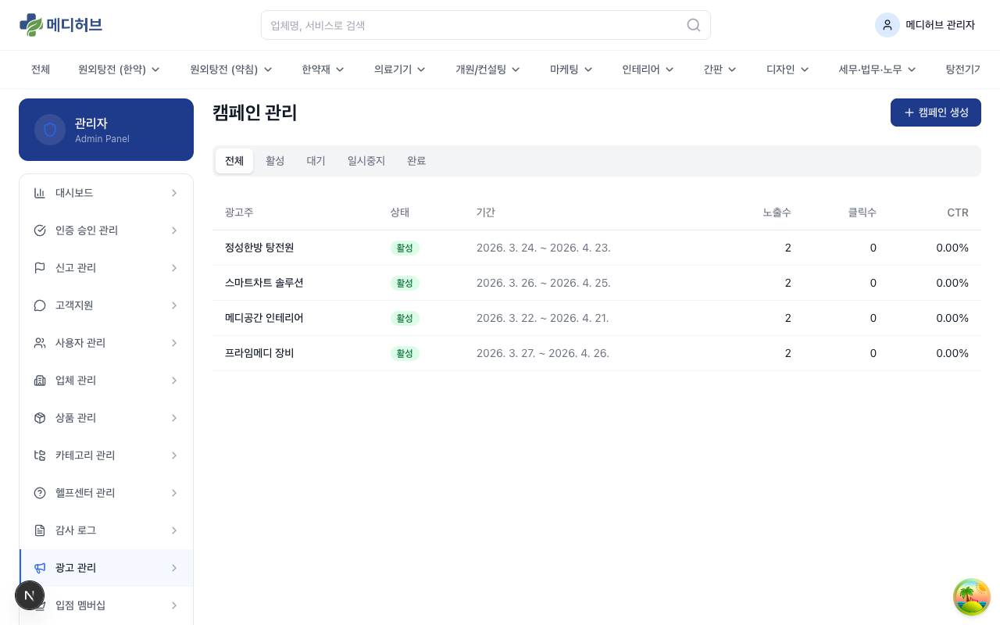
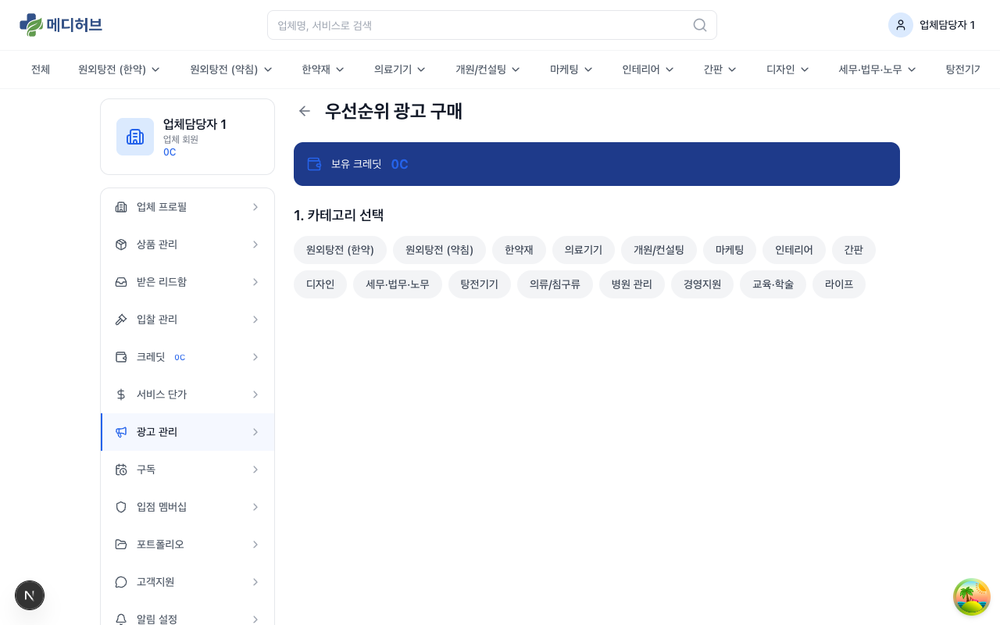
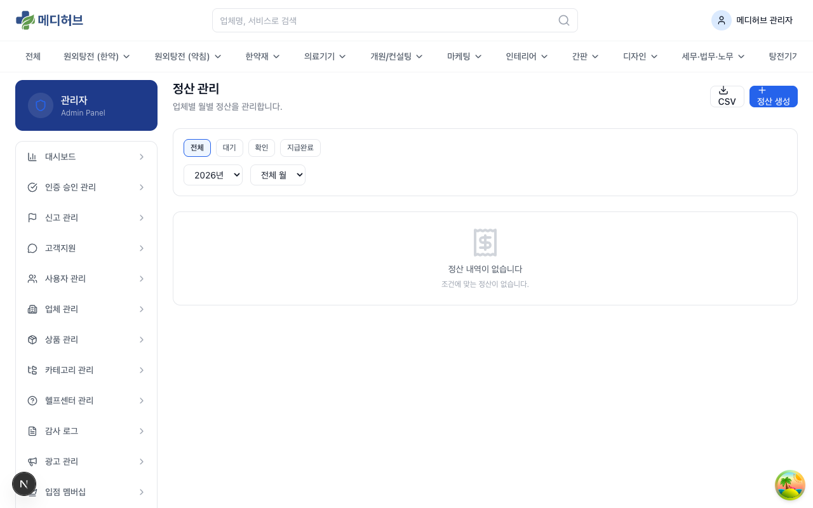
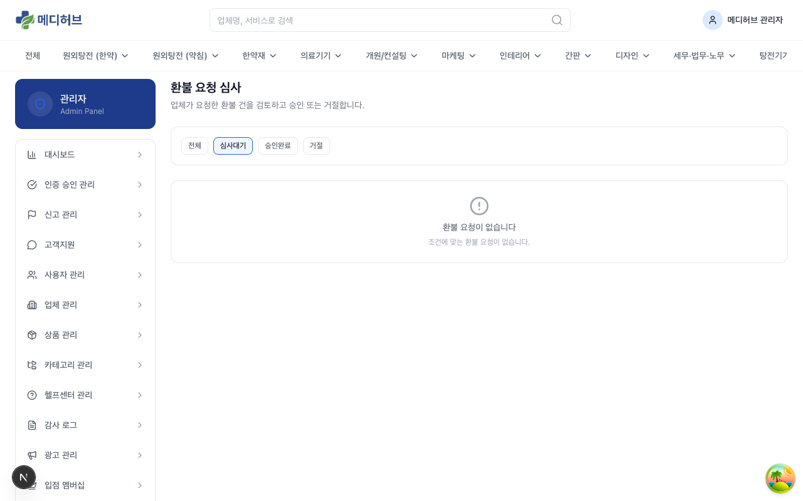
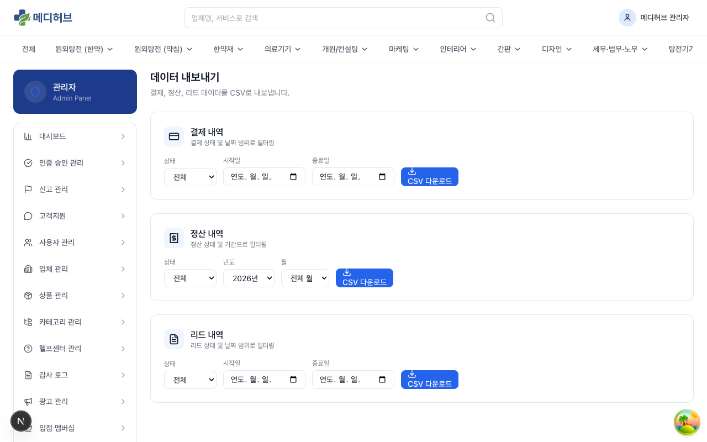

# 수익화 / 과금 가이드

> 메디허브의 수익 모델과 과금 시스템을 종합적으로 안내합니다. 운영 시 가장 자주 참조할 문서입니다.

---

## 1. 수익 모델 개요

메디허브는 **6가지 수익원**으로 구성됩니다:

| # | 수익원 | 모델 | 대상 | 예상 매출 (1년차) |
|---|-------|------|------|---------------|
| 1 | **입점비 (연회비)** | S등급 업종 연 200만원 | 원외탕전/약재 업체 (~295개) | ~1.77억 |
| 2 | **리드 과금 (CPL)** | 건별 크레딧 차감 (1~20만원) | 모든 업체 | 리드 수 비례 |
| 3 | **기간제 구독** | 30~365일 무제한 리드 수신 | 모든 업체 | 구독 수 비례 |
| 4 | **배너 광고** | 메인 200만/월, 서브 120만/월 | 광고주 업체 | ~2.02억 |
| 5 | **우선순위 노출** | 주 3~30만원 (4등급) | 모든 업체 | ~0.81억 |
| 6 | **비딩 수수료** | 계약 금액의 3% | 인테리어 업체 | 계약 규모 비례 |

---

## 2. 크레딧 시스템

### 2-1. 크레딧이란?

크레딧은 메디허브에서 사용하는 **선불 가상화폐**입니다. 업체가 리드 수신, 구독, 광고 등을 이용할 때 크레딧으로 결제합니다.

### 2-2. 크레딧 정책

| 항목 | 정책 |
|------|------|
| **충전 방식** | TossPayments 결제 (카드/계좌이체 등) |
| **유효기간** | 충전일로부터 **12개월** |
| **자동충전** | 설정 가능 (잔액 기준 자동 충전) |
| **자동충전 보너스** | 자동충전 시 **2% 보너스** 추가 지급 |
| **환불** | 미사용 크레딧에 한해 환불 가능 (관리자 처리) |

### 2-3. 크레딧 흐름

```
충전(TossPayments) → 크레딧 잔액 증가
                   ↓
리드 수신 → 크레딧 차감 (서비스 단가 기준)
구독 구매 → 크레딧 차감 (구독 가격)
광고 구매 → 크레딧 차감 (광고 가격)
입점비 납부 → 크레딧 차감 (200만원)
                   ↓
무응답 복구 → 크레딧 복구 (72시간 무응답 시)
허위 리드 → 크레딧 복구 (관리자 승인 시)
관리자 수동 지급 → 크레딧 증가 (베타 보상 등)
```

---

## 3. TossPayments 결제

### 3-1. 결제 흐름



1. 파트너센터 > 크레딧 > **충전하기** 클릭
2. 충전 패키지 선택 (10만/30만/50만/100만원)
3. TossPayments 결제 위젯 로드
4. 결제 수단 선택 (카드, 계좌이체, 간편결제 등)
5. 결제 진행
6. **성공**: 크레딧 즉시 충전 + 성공 페이지
7. **실패**: 실패 페이지 + 재시도 안내

### 3-2. 결제 관련 페이지

- `/partner/credits/charge` — 충전 페이지 (패키지 선택 + 결제)
- `/partner/credits/charge/success` — 결제 성공
- `/partner/credits/charge/fail` — 결제 실패

### 3-3. 웹훅

결제 상태 변경은 TossPayments 웹훅으로 실시간 반영됩니다:
- 결제 승인 → 크레딧 충전
- 결제 취소 → 크레딧 차감

> 운영 환경에서는 TossPayments 대시보드에서 웹훅 URL(`/api/payments/webhook`)을 등록해야 합니다.

---

## 4. 리드 과금 (CPL)

### 4-1. 과금 원리

한의사가 업체에 문의(리드)를 보내면, 해당 업체의 크레딧에서 **서비스 단가만큼 자동 차감**됩니다.

```
한의사 → 문의 생성 → 업체 크레딧 차감 → 업체에 리드 전달
```

### 4-2. 서비스 단가

- 업체가 **파트너센터 > 서비스 단가**에서 카테고리별로 직접 설정
- 범위: **1만원 ~ 20만원** (카테고리/서비스별 차등)
- 복수 서비스 문의 시 **단가 합산**



> 서비스 단가를 설정하지 않은 카테고리로는 리드를 수신할 수 없습니다.

### 4-3. 중복 리드 감지

- **30일 이내** 동일 한의사 → 동일 업체 문의 시 **중복으로 판정**
- 중복 리드는 **무료** 처리 (크레딧 미차감)

### 4-4. 무응답 처리

| 경과 시간 | 처리 | 알림 |
|---------|------|------|
| **48시간** | 무응답 경고 | 카카오톡/이메일 알림 발송 |
| **72시간** | **자동 크레딧 복구** | 크레딧 복구 알림 |

### 4-5. 허위 리드 신고 → 환불

1. 업체가 **받은 리드함 > 리드 상세 > 신고** 클릭
2. 신고 사유 입력 (전화번호 오류, 테스트성, 연락 불가 등)
3. **관리자 심사**
4. 승인 시 → **크레딧 자동 복구**
5. 거절 시 → 사유와 함께 통보

### 4-6. 크레딧 부족 시

업체의 크레딧 잔액이 서비스 단가보다 적으면:
- 리드 수신이 **소프트 거절**됨 (한의사에게 다른 업체 안내)
- 업체에 **크레딧 부족 알림** 발송

---

## 5. 기간제 구독

### 5-1. 구독이란?

구독 기간 동안 해당 카테고리의 리드를 **무제한 무료**로 수신합니다. 건별 크레딧 차감이 면제됩니다.

### 5-2. 구독 상품

| 기간 | 특징 |
|------|------|
| **30일** | 단기 체험 |
| **60일** | 2개월 |
| **90일** | 3개월 (분기) |
| **180일** | 6개월 (반기) |
| **365일** | 1년 (연간) |



### 5-3. 구독 구매

1. 파트너센터 > 구독 > **구독 시작하기** 클릭
2. 카테고리 선택
3. 기간 선택
4. 크레딧으로 결제
5. 즉시 적용 → 해당 카테고리 리드 무료 수신

### 5-4. 구독 만료 알림

- 만료 **7일 전**: 이메일 알림
- 만료 **1일 전**: 이메일 알림
- 만료 후: 건별 과금으로 자동 전환

### 5-5. 구독 vs 건별 과금 판단

- 월 리드 수가 많은 카테고리 → **구독이 유리**
- 간헐적 리드 → **건별 과금이 유리**
- 구독 중인 카테고리로 들어오는 리드는 `hasActiveSubscription` 체크 → 무료 처리

---

## 6. 입점 멤버십 (S등급 연회비)

### 6-1. 대상 업종

| 업종 | 예상 업체 수 |
|------|----------|
| 원외탕전 (한약) | ~120개 |
| 원외탕전 (약침) | ~25개 |
| 약재회사/제약사 | ~150개 |
| **합계** | **~295개** |

### 6-2. 연회비

- **금액**: 연 200만원
- **결제**: 크레딧으로 납부

### 6-3. 미납 vs 납부 비교

| 기능 | 미납 | 납부 |
|------|------|------|
| 기본 입점 | O | O |
| 검색 노출 | **하위 노출** | 정상 |
| 리드 수신 | **차단** | 정상 |
| 프로필 공개 | O | O |
| 광고 구매 | 제한 | 가능 |

### 6-4. 만료 알림

- 만료 **30일 전**: 이메일 알림
- 만료 **7일 전**: 이메일 알림

### 6-5. 관리자 관리



관리자는 **관리자 > 입점 멤버십**에서:
- 업체별 납부 상태 확인
- 유효기간 확인
- 필요 시 해지 처리

---

## 7. 배너 광고

### 7-1. 배너 슬롯

| 슬롯 | 위치 | 가격 | 수량 |
|------|------|------|------|
| **메인 배너** | 메인 페이지 히어로 | 200만/월 | 3개 (x2배수 = 6광고주) |
| **서브 배너** | 메인 페이지 중단 | 120만/월 | 2개 (x2배수 = 4광고주) |

### 7-2. 운영 방식

- **정액형 (CPM)**: 월 고정 금액
- **랜덤 회전형**: 2배수 광고주 → 새로고침 시 랜덤 노출
- **클릭 트래킹**: 클릭 수 자동 집계 (CTR 리포트 제공)

### 7-3. 관리



- **관리자 > 광고 관리 > 캠페인**에서 배너 캠페인 CRUD
- 크리에이티브(배너 이미지) + 클릭 URL 등록
- 기간/예산 설정
- 성과 리포트 확인 (노출수/클릭수/CTR)

---

## 8. 우선순위 노출 광고

### 8-1. 등급 체계

| 등급 | 가격 (주당) | 노출 위치 | 특별 혜택 |
|------|----------|---------|---------|
| **프리미엄** | 30만원 | 카테고리 1줄째 | 배경 강조, 배지 |
| **플러스업** | 21만원 | 카테고리 2줄째 | 배경 강조 |
| **플러스** | 6만원 | 카테고리 3줄째 | - |
| **루키** | 3만원 | 카테고리 4줄째 | 점프업 3회 |

### 8-2. 슬롯 구조

- 카테고리당 **4줄 x 4개 = 16슬롯**
- **주 단위** 상품
- 카테고리별로 슬롯이 독립 운영

### 8-3. 루키 점프업

루키 등급 구매 시 기간 내 **3회 점프업** 가능:
- **1일 1회** 사용
- 사용 시 **30분간 프리미엄 위에 최상단 노출**
- 파트너센터 > 광고 관리에서 **점프업** 버튼 클릭

### 8-4. 구매 방법



1. 파트너센터 > 광고 관리 > **광고 구매** 클릭
2. 카테고리 선택
3. 등급 선택
4. 빈 슬롯 확인
5. 크레딧으로 결제

---

## 9. 비딩 (인테리어)

### 9-1. 비딩 프로세스

```
한의사: 프로젝트 등록 → 시스템: 자동 매칭(3개) → 업체: 견적 제출 → 한의사: 업체 선정 → 계약 → 수수료 3%
```

### 9-2. 자동 매칭 스코어링

| 항목 | 가중치 |
|------|-------|
| 지역 일치 | 30% |
| 평점 | 25% |
| 응답률 | 20% |
| 포트폴리오 | 15% |
| 가격 적합도 | 10% |

### 9-3. 관련 화면

- **한의사**: `/interior/create` — 프로젝트 등록
- **업체**: `/partner/bids` — 입찰 관리
- **관리자**: `/admin/bid-projects` — 프로젝트 현황/분쟁 대응

---

## 10. 정산

### 10-1. 정산 프로세스

```
월말 → 정산 자동 생성 (Cron) → 관리자 검토 → 정산 승인 → 지급 처리
```

### 10-2. 정산 단위

- **업체별** 월간 정산 (합산이 아닌 업체별)
- 정산 항목: 리드 과금 수익, 구독 수익, 광고 수익, 입점비 수익

### 10-3. 정산 상태

| 상태 | 설명 |
|------|------|
| **대기** | 정산이 생성됨, 관리자 검토 대기 |
| **확인** | 관리자가 내역 확인 완료 |
| **승인** | 정산 금액 확정 |
| **지급완료** | 실제 송금 완료 |

### 10-4. 관리 방법



- **관리자 > 정산 관리**에서 월별/업체별 정산 관리
- **정산 생성** 버튼으로 수동 생성 가능
- **CSV 내보내기**로 엑셀 다운로드 → 수동 이체 (초기 운영)

> 초기에는 자동 Cron보다 **관리자 수동 트리거** 권장. 예외 케이스(환불 진행 중, 분쟁 중)를 확인한 후 정산 확정.

---

## 11. 환불/보상

### 11-1. 환불 사유

| 사유 | 처리 |
|------|------|
| 무응답 (72시간) | **자동** 크레딧 복구 |
| 중복 리드 (30일 이내) | **자동** 무료 처리 |
| 허위 리드 (업체 신고) | **수동** 관리자 심사 후 복구 |
| SLA 미달 | **수동** 관리자 판단 |

### 11-2. 환불 요청 프로세스

1. 업체: 파트너센터에서 **환불 요청** 제출
2. 관리자: **관리자 > 환불 관리**에서 심사
3. 승인 시: 크레딧 자동 복구 + 감사 로그 기록
4. 거절 시: 거절 사유 통보



---

## 12. 데이터 내보내기



### 12-1. 내보내기 가능 데이터

| 데이터 | API 경로 | 내용 |
|-------|---------|------|
| **결제 내역** | `GET /api/exports/payments` | TossPayments 결제 이력 |
| **정산 내역** | `GET /api/exports/settlements` | 업체별 정산 데이터 |
| **리드 내역** | `GET /api/exports/leads` | 리드 발생/상태/과금 데이터 |

### 12-2. 사용 방법

1. **관리자 > 데이터 내보내기** 접근
2. 내보낼 데이터 유형 선택
3. **기간 설정** (시작일 ~ 종료일)
4. **CSV 다운로드** 클릭

---

## 13. 관리자 수동 크레딧 지급/차감

### 13-1. 사용 사례

- **베타 보상**: 초기 참여 업체에 보상 크레딧 지급
- **프로모션**: 이벤트 당첨 업체에 크레딧 지급
- **오류 보상**: 시스템 오류로 인한 크레딧 보상
- **어뷰징 제재**: 부정 사용 업체의 크레딧 차감
- **오입금 정정**: 잘못 충전된 크레딧 차감

### 13-2. 처리 방법

1. **관리자 > 베타 운영 콘솔** 또는 업체 상세에서 처리
2. 지급/차감 금액 입력
3. 사유 입력 (필수)
4. **확인** 클릭

> 모든 수동 크레딧 조작은 **감사 로그**에 자동 기록됩니다. 사유 입력은 필수입니다.

---

## 14. 과금 관련 Cron 작업 (자동화)

시스템에서 자동으로 실행되는 과금 관련 작업:

| 작업 | 주기 | 설명 |
|------|------|------|
| 무응답 리드 처리 | 매일 1회 | 48h 경고 알림 + 72h 자동 크레딧 복구 |
| 구독 만료 알림 | 매일 1회 | 7일/1일 전 만료 알림 발송 |
| 입점 멤버십 만료 알림 | 매일 1회 | 30일/7일 전 만료 알림 발송 |
| 월별 정산 생성 | 월 1회 | 전월 정산 자동 생성 |

> 현재 Vercel Hobby 플랜으로 Cron은 **하루 1회** 실행됩니다. Pro 전환 시 매시간 실행으로 변경 가능합니다.
